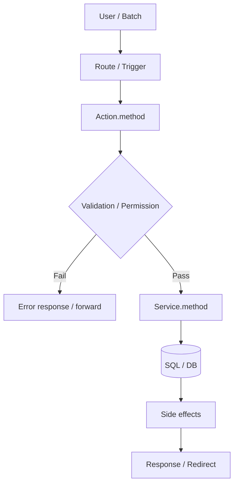
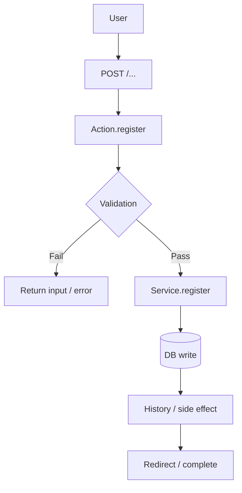
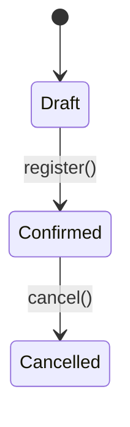

# Workflow: Generate & Review Legacy Workflow Documentation từ SalesCube Java

## Mục tiêu

Phân tích Java source của SalesCube và sinh tài liệu workflow chuẩn tại:

```text
output/workflows/
```

Mỗi workflow phải mô tả được:

- Entry point và tác nhân khởi tạo.
- Luồng xử lý legacy thực tế: Route → Action → Service → SQL → DB/side effects → Response.
- Validation, permission, status transition, exception và redirect/forward behavior.
- Bằng chứng nguồn cho từng claim quan trọng.
- Các điểm chưa xác minh phải được phân biệt rõ với hành vi đã xác nhận.

> Không được biến suy luận từ tên class/method thành behavior legacy đã xác nhận.

---

## Quy ước Provenance

Mọi nội dung nghiệp vụ, side effect, mapping và nhận định quan trọng phải có một trong các nhãn:

| Nhãn | Ý nghĩa |
|---|---|
| `JAVA_CONFIRMED` | Có bằng chứng trực tiếp từ Java Action/Service/Form/DTO |
| `SQL_CONFIRMED` | Có bằng chứng từ Named SQL / query |
| `DDL_CONFIRMED` | Có bằng chứng từ DDL/table definition |
| `WF_CONFIRMED` | Có bằng chứng từ workflow/spec hiện có |
| `INFERRED` | Suy luận hợp lý nhưng chưa có code rõ ràng |
| `UNKNOWN` | Không tìm được evidence trong source hiện có |

## Quy tắc bắt buộc

1. Không coi mỗi public Action method là một workflow độc lập.
2. Không tự suy đoán HTTP method hoặc route nếu framework mapping chưa được tìm thấy.
3. Không tự suy đoán bảng DB chỉ từ tên entity.
4. Không tự suy đoán side effect như `HIST`, `EAD`, `SEQ_MAKER`, stock update hoặc email.
5. Không tự gộp các Action khác nhau thành một workflow nếu chưa xác minh cùng use case.
6. Không dừng batch để hỏi user; ghi vấn đề vào `_open-questions.md`.
7. Không đánh dấu workflow hoàn thành chỉ vì đã có sơ đồ; phải có evidence coverage.
8. Mọi file/line reference ưu tiên dùng `Class.method() → helper()` kèm range line nếu có.

---

## Output structure

```text
output/workflows/
├── _index.md
├── _open-questions.md
├── _inventory/
│   ├── routes.md
│   └── use-cases.md
├── _evidence/
│   └── WF-<NN>-<kebab-name>.md
├── _reports/
│   └── WF-<NN>-<kebab-name>-review.md
└── WF-<NN>-<kebab-name>.md
```

Nếu repository đã có convention khác, ưu tiên convention hiện hữu.

---

## Naming convention

```text
WF-<NN>-<kebab-case-name>.md
```

Ví dụ:

```text
WF-03-receive-order.md
WF-07-close-billing.md
```

## Quy tắc đánh số

1. Đọc `output/workflows/_index.md` hoặc scan các file `WF-*.md`.
2. Lấy số lớn nhất hiện có.
3. Tạo số kế tiếp, zero-pad hai chữ số.
4. Không tái sử dụng số đã có, kể cả workflow deprecated.
5. Nếu đang tái tạo tài liệu cho workflow đã tồn tại, cập nhật file hiện hữu thay vì tạo số mới.

---

# Phase 0 – Repository Preflight

## Mục tiêu

Xác minh source, framework convention và đường dẫn trước khi trace workflow.

## Kiểm tra bắt buộc

- Repository root.
- Branch hiện tại.
- Java Action package path.
- Java Service package path.
- Form/DTO/entity path.
- Named SQL path.
- JSP/view path.
- Framework route mapping source:
  - annotation controller/action,
  - `routes.xml`,
  - convention framework,
  - `web.xml`,
  - Struts/SAStruts config,
  - filter/interceptor config.
- DDL source path.
- Workflow index hiện có.
- Existing documentation convention.
- Test source nếu có.

## Output

```markdown
## Preflight Result

| Item | Path / Value | Status |
|---|---|---|
| Action source | `.../action/` | Found |
| Service source | `.../service/` | Found |
| Named SQL | `.../entity/sql/` | Found |
| JSP source | `.../WEB-INF/view/` | Found |
| Route mapping | `...` | Found / Partial / Missing |
| DDL | `SalesCube/DB/sql/CREATE.sql` | Found |
| Existing workflow index | `output/workflows/_index.md` | Found |
```

Nếu route mapping không xác định được, route phải ghi `UNKNOWN`, không tự điền URL.

---

# Phase 1 – Route & Use-case Inventory

## Mục tiêu

Không bắt đầu từ “một class = một workflow”.

Phải lập inventory để xác định:

- Route nào tồn tại.
- Public Action method nào được gọi từ user/system.
- Những method nào là helper.
- Những route nào cùng thuộc một use case.
- Batch/import/export có entry point riêng hay không.

## 1.1 Route Inventory

Tạo file:

```text
output/workflows/_inventory/routes.md
```

Template:

```markdown
# Route Inventory

| Route / URL | HTTP Method | Action Class | Method | Entry Type | Evidence | Status |
|---|---|---|---|---|---|---|
| `/receiveOrder/input` | POST / UNKNOWN | `InputRoSlipAction` | `input()` | Screen entry | `<mapping source>` | Confirmed |
| `/receiveOrder/register` | POST / UNKNOWN | `InputRoSlipAction` | `register()` | Submit | `<mapping source>` | Confirmed |
| — | — | `InputRoSlipAction` | `validateHeader()` | Helper | Java method usage | Internal |
```

## 1.2 Use-case Inventory

Tạo file:

```text
output/workflows/_inventory/use-cases.md
```

Template:

```markdown
# Workflow Use-case Inventory

| Use Case | Candidate Actions / Methods | Trigger | Proposed Workflow | Confidence | Status |
|---|---|---|---|---|---|
| Receive order create | `InputRoSlipAction.input/register/complete` | User submit | `WF-03-receive-order` | MEDIUM | Planned |
| Receive order cancel | `InputRoSlipAction.cancel` | User submit | `WF-04-cancel-receive-order` | HIGH | Planned |
| Receive order CSV export | `ReceiveOrderAction.download` | User action | `WF-05-export-receive-order` | MEDIUM | Planned |
```

## Classification

Mỗi public method phải được phân loại:

| Type | Ý nghĩa |
|---|---|
| `SCREEN_ENTRY` | Hiển thị danh sách/form/confirm |
| `SEARCH` | Tìm kiếm/lọc |
| `CREATE` | Tạo record |
| `UPDATE` | Cập nhật record |
| `CANCEL_OR_STATUS` | Hủy/chuyển trạng thái |
| `EXPORT` | CSV/PDF/Excel |
| `IMPORT` | Import file/EC data |
| `AJAX_VALIDATION` | Validation/lookup bất đồng bộ |
| `BATCH` | Batch/scheduler |
| `INTERNAL_HELPER` | Helper, không phải workflow entry |
| `UNKNOWN` | Chưa xác định |

---

# Phase 2 – Evidence Collection

## Nguồn cần trace

1. Java Action class.
2. Parent action/base class.
3. Java Service class(es).
4. Form / DTO / entity classes.
5. Named SQL files.
6. DDL.
7. JSP / template / view.
8. Route configuration.
9. Existing workflow/spec docs.
10. Batch config/job scheduler/import handler nếu có.

## Evidence file

Tạo file:

```text
output/workflows/_evidence/WF-<NN>-<kebab-name>.md
```

Template:

```markdown
# Evidence: WF-<NN> <Workflow Name>

## Sources

| Type | Source | Relevance |
|---|---|---|
| Route mapping | `<path>` | URL + HTTP method |
| Action | `InputRoSlipAction.java` | Entry/action flow |
| Service | `RoSlipService.java` | Business logic |
| Form | `InputRoSlipForm.java` | Input + validation |
| SQL | `entity/sql/RoSlip.sql` | Read/write/query condition |
| DDL | `CREATE.sql` | Tables/columns |
| JSP | `input.jsp` | Screen input / submit path |

## Extracted Evidence

| Category | Finding | Provenance | Evidence Anchor |
|---|---|---|---|
| Route | `/receiveOrder/register` | JAVA_CONFIRMED | route config |
| Permission | `MENU_ID.XXX` check | JAVA_CONFIRMED | `InputRoSlipAction.register()` |
| Service Call | `roSlipService.register(...)` | JAVA_CONFIRMED | `InputRoSlipAction.register()` |
| Validation | Customer required | JAVA_CONFIRMED | `InputRoSlipForm.validate()` |
| DB Write | `T_RO_SLIP_TRN` insert | SQL_CONFIRMED | `RoSlipService.register()` → SQL |
| Side Effect | History insert | JAVA_CONFIRMED | `RoSlipService.registerHistory()` |
```

## Evidence anchor rule

Ưu tiên:

```text
InputRoSlipAction.register() → roSlipService.register() → validateCustomer() → lines 120-178
```

Thay vì chỉ:

```text
InputRoSlipAction.java:120
```

---

# Phase 3 – Trace Route → Action → Service → SQL

## Mục tiêu

Trace từng use case theo đường đi thực tế, không chỉ liệt kê class.

## Trace method

Với mỗi route/use case:

1. Xác định entry point.
2. Trace Action method.
3. Ghi request/form/session values được đọc.
4. Ghi permission checks/interceptors/base class behavior.
5. Trace từng Service method được gọi.
6. Trace helper methods có business decision.
7. Trace Named SQL / ORM calls.
8. Xác định bảng đọc/ghi từ SQL hoặc service persistence code.
9. Xác định side effects.
10. Xác định response:
   - forward JSP,
   - redirect,
   - JSON,
   - download,
   - exception/error page,
   - batch result/log.

## Không được coi là evidence đủ

Các tín hiệu sau chỉ là gợi ý, không phải bằng chứng:

- Tên class (`CloseBillAction`).
- Tên table.
- Tên enum/status.
- Tên JSP.
- Tên method `register()`.
- Comment không khớp với code thực tế.

Gắn `INFERRED` khi chỉ có tín hiệu như trên.

---

# Phase 4 – Workflow Modeling

## Mục tiêu

Mỗi file WF phải đại diện cho một use case nghiệp vụ có thể hiểu và kiểm thử, không phải dump source code.

## Bắt buộc phân biệt

### Legacy-confirmed flow

Các bước có evidence trực tiếp từ code.

### Alternative/error flow

Các nhánh điều kiện, exception, validation fail, lock conflict, permission deny.

### Inferred/unknown section

Những phần chưa đủ evidence; không chen vào main flow như fact.

## Flow diagram rule

Dùng Mermaid flowchart nếu repository/document renderer hỗ trợ; nếu không dùng text-based.

### Mermaid template



### Text fallback

```text
[User]
  → [Route / Trigger]
  → [Action.method()]
  → [Validation / Permission]
  → [Service.method()]
  → [SQL / DB]
  → [Side effects]
  → [Response / Redirect]
```

> Flow diagram phải dùng IDs/labels phù hợp với evidence; không bịa thêm step.

---

# Phase 5 – Generate Workflow Document

## Output path

```text
output/workflows/WF-<NN>-<kebab-case-name>.md
```

## Template

```markdown
# WF-<NN>: <Tên Workflow> (<Tên tiếng Nhật>)

> **Confidence**: HIGH / MEDIUM / LOW  
> **Evidence file**: [`_evidence/WF-<NN>-<name>.md`](./_evidence/WF-<NN>-<name>.md)  
> **Scope**: <use case boundary>

---

## 0. Evidence & Confidence

| Area | Status | Evidence |
|---|---|---|
| Route mapping | Confirmed / Partial / Missing | `<source>` |
| Action flow | Confirmed / Partial / Missing | `<Class.method()>` |
| Service logic | Confirmed / Partial / Missing | `<Class.method()>` |
| SQL / DB mapping | Confirmed / Partial / Missing | `<sql/source>` |
| Side effects | Confirmed / Partial / Missing | `<source>` |

### Confidence rule

- **HIGH**: Route, Action, Service và DB/side effect coverage >= 90%; không có unknown high impact.
- **MEDIUM**: Có phần source thiếu, hoặc unknown low/medium impact.
- **LOW**: Route/service/SQL không trace được đầy đủ, hoặc unknown high impact.

---

## 1. Tổng quan

| Trường | Giá trị | Provenance |
|---|---|---|
| **Workflow** | <mô tả ngắn> | JAVA_CONFIRMED / WF_CONFIRMED |
| **Module** | <module> | JAVA_CONFIRMED / INFERRED |
| **Trigger** | User action / batch / import | JAVA_CONFIRMED |
| **Actor** | Role / user type / system | JAVA_CONFIRMED / UNKNOWN |
| **Preconditions** | <required state/data> | JAVA_CONFIRMED / SQL_CONFIRMED |
| **Entry route** | `<HTTP> <path>` | JAVA_CONFIRMED / UNKNOWN |
| **Primary Action** | `<ActionClass.method()>` | JAVA_CONFIRMED |

---

## 2. Entry Points & Related Components

### Routes

| HTTP | Route | Action / Method | Type | Provenance | Evidence |
|---|---|---|---|---|---|
| POST | `/...` | `Action.register()` | CREATE | JAVA_CONFIRMED | `<route source>` |

### Components

| Layer | Class/File | Responsibility | Provenance |
|---|---|---|---|
| Action | `InputRoSlipAction` | Entry / response handling | JAVA_CONFIRMED |
| Service | `RoSlipService` | Business logic | JAVA_CONFIRMED |
| Form | `InputRoSlipForm` | Binding / validation | JAVA_CONFIRMED |
| SQL | `RoSlip.sql` | Query/persistence | SQL_CONFIRMED |

---

## 3. Main Flow



### Step 1: <Tên bước>

| Item | Detail |
|---|---|
| **Action** | `<ActionClass>.java:<method>()` |
| **Service** | `<ServiceClass>.java:<method>()` |
| **SQL / Persistence** | `<sql file or persistence method>` |
| **Logic** | <mô tả chỉ từ evidence> |
| **DB read/write** | <tables + operation> |
| **Side effects** | <history/sequence/stock/etc.> |
| **Response** | <forward/redirect/json/download> |
| **Provenance** | JAVA_CONFIRMED / SQL_CONFIRMED |
| **Evidence** | `<anchor>` |

### Step 2: ...

---

## 4. Alternative / Error Flows

| ID | Condition | Legacy handling | Provenance | Evidence |
|---|---|---|---|---|
| ALT-01 | Validation fail | Return form with messages | JAVA_CONFIRMED | `<Form.validate()>` |
| ERR-01 | ServiceException | Error page / message / redirect | JAVA_CONFIRMED | `<Action.method()>` |
| ERR-02 | Lock conflict | Unknown / retry / message | UNKNOWN | Source not found |

---

## 5. Validation & Permission Rules

### Permission

| ID | Rule | Provenance | Evidence |
|---|---|---|---|
| PERM-01 | Requires `MENU_ID.<...>` | JAVA_CONFIRMED | `<Action/BaseAction>` |

### Validation

| ID | Field / Context | Rule | Handling | Provenance | Evidence |
|---|---|---|---|---|---|
| VAL-01 | `customerCd` | Required | Error message | JAVA_CONFIRMED | `<Form.validate()>` |
| VAL-02 | Header/detail | Cross-field consistency | Block submit | JAVA_CONFIRMED / INFERRED | `<source>` |

---

## 6. Business Rules & Status Transitions

### Business Rules

| ID | Rule | Severity | Provenance | Evidence |
|---|---|---|---|---|
| BR-01 | <rule> | Block / Warning | JAVA_CONFIRMED | `<Service.helper()>` |

### Status Transitions

Chỉ tạo khi có evidence về status field và transition.



| From | Event | To | Provenance | Evidence |
|---|---|---|---|---|
| `DRAFT` | `register()` | `CONFIRMED` | JAVA_CONFIRMED | `<Service.register()>` |

Nếu không tìm thấy status transition:

```text
Status transition: UNKNOWN — no confirmed status mutation found.
```

---

## 7. Database & Side Effects

### Database tables

| Table | Operation | Purpose | Provenance | Evidence |
|---|---|---|---|---|
| `TABLE_NAME` | READ | Lookup / validation | SQL_CONFIRMED | `<sql>` |
| `TABLE_NAME` | INSERT | Main transaction | SQL_CONFIRMED | `<sql>` |
| `TABLE_NAME_HIST` | INSERT | Audit/history | JAVA_CONFIRMED / SQL_CONFIRMED | `<source>` |

### Side effects

| Side effect | Trigger | Provenance | Evidence |
|---|---|---|---|
| Update `SEQ_MAKER` | Before insert | JAVA_CONFIRMED | `<service>` |
| Create history | After write | SQL_CONFIRMED | `<sql>` |
| EAD sync | After commit | UNKNOWN / JAVA_CONFIRMED | `<source>` |

---

## 8. Legacy Response Behavior

| Scenario | Response type | Destination / Message | Provenance | Evidence |
|---|---|---|---|---|
| Success | Forward / redirect | `<path/JSP>` | JAVA_CONFIRMED | `<Action.method()>` |
| Validation fail | Forward | `<input.jsp>` | JAVA_CONFIRMED | `<Action.method()>` |
| System error | Error page / redirect | `<error route>` | JAVA_CONFIRMED / UNKNOWN | `<source>` |

---

## 9. Migration Risks

| ID | Risk | Why it matters | Provenance | Mitigation |
|---|---|---|---|---|
| RISK-01 | Sequence generated in app layer | Target DB ID policy may differ | JAVA_CONFIRMED | Decide ID strategy before migration |
| RISK-02 | No DB FK constraint | Relations may be app-layer only | SQL_CONFIRMED / DDL_CONFIRMED | Preserve scalar reference until confirmed |
| RISK-03 | Status behavior unclear | Incorrect transition can break billing | UNKNOWN | Add test + confirm business owner |

---

## 10. Open Questions / Inferred Items

| ID | Type | Item | Proposed interpretation | Impact | Status |
|---|---|---|---|---|---|
| OQ-01 | UNKNOWN | <question> | <default/proposal> | High / Medium / Low | Open |
| INF-01 | INFERRED | <inference> | <reason> | Medium | Needs verification |
```

---

# Phase 6 – Gap Check

## G1 – Build requirement list

Đọc lại source đã trace và lập danh sách:

```markdown
REQUIREMENT LIST:
[ ] ROUTE: each discovered route/entry point
[ ] ACTION_METHOD: each relevant Action method
[ ] SERVICE_CALL: each business-relevant service call
[ ] SQL_QUERY: each relevant query/persistence operation
[ ] TABLE_READ: each confirmed SELECT table
[ ] TABLE_WRITE: each confirmed INSERT/UPDATE/DELETE table
[ ] SIDE_EFFECT: each history/sequence/EAD/export/batch side effect
[ ] VALIDATION: each validation rule
[ ] PERMISSION: each permission check
[ ] STATUS_TRANSITION: each confirmed status mutation
[ ] ERROR_CASE: each exception/error handling path
[ ] RESPONSE: each confirmed forward/redirect/json/download behavior
```

## G2 – Compare source vs workflow output

Status meanings:

- `[x]` Present, correct and sourced.
- `[~]` Present but incomplete, ambiguous or weakly sourced.
- `[ ]` Missing.

## G3 – Resolve gaps

- Tự bổ sung nếu evidence đã đủ.
- Gắn `INFERRED` nếu logic chỉ suy ra được từ flow/tên gọi.
- Gắn `UNKNOWN` nếu chưa tìm thấy evidence.
- Không hỏi user giữa batch.
- Ghi unknown high-impact vào `output/workflows/_open-questions.md`.

## G4 – Gap report

```markdown
🔍 Gap Check: <Workflow Name>

Evidence coverage: <X>/<N>
Route coverage: <X>/<N>
Service coverage: <X>/<N>
DB/side-effect coverage: <X>/<N>

Auto-fixed gaps: <N>
Inferred items: <N>
Unknown items: <N>
High-impact unknowns: <N>

Open items:
- [ ] <item> — INFERRED / UNKNOWN: <reason>
```

---

# Phase 7 – Review

## R1 – Re-read generated workflow

Đọc lại toàn bộ file:

```text
output/workflows/WF-<NN>-<name>.md
```

và evidence file tương ứng.

## R2 – Quality checklist

### Scope & entry points

- [ ] Workflow represents a coherent use case, not a raw class dump.
- [ ] Route/HTTP method is sourced or explicitly `UNKNOWN`.
- [ ] Public methods are classified as entry point vs helper.
- [ ] Related Action methods are included only when they belong to this use case.
- [ ] Batch/import/export entry point is documented when applicable.

### Traceability

- [ ] Main path traces Action → Service → SQL/persistence.
- [ ] Every business-relevant service call is covered.
- [ ] DB tables are separated into READ and WRITE.
- [ ] History, sequence, EAD, stock and other side effects are covered when evidenced.
- [ ] Each important claim includes source + anchor.
- [ ] DDL is used to validate table names/columns when available.

### Behavior

- [ ] Validation rules are listed with source.
- [ ] Permission checks are listed with source.
- [ ] Error/exception paths are separated from main flow.
- [ ] Status transitions are included only with evidence.
- [ ] Response behavior includes forward/redirect/download/JSON where confirmed.
- [ ] `INFERRED` and `UNKNOWN` are not presented as facts.

### Quality

- [ ] Mermaid/text diagram matches described main flow.
- [ ] Workflow links to evidence file.
- [ ] Confidence has a documented basis.
- [ ] Migration risks contain actionable implications.
- [ ] Open questions are recorded.
- [ ] `_index.md` is updated.

## R3 – Review report

Create:

```text
output/workflows/_reports/WF-<NN>-<name>-review.md
```

Template:

```markdown
# Review Report: WF-<NN> <Name>

## Result

| Metric | Result |
|---|---|
| Evidence coverage | X/N |
| Route coverage | X/N |
| Service coverage | X/N |
| DB/side-effect coverage | X/N |
| Checklist passed | X/Y |
| Confidence | HIGH / MEDIUM / LOW |

## Auto-fixed gaps
- ...

## Inferred items
- ...

## Unknown items
- ...

## High-impact open questions
- ...
```

---

# Index update

Create/update:

```text
output/workflows/_index.md
```

Template:

```markdown
# Workflow Index

| Workflow | Name | Module | Confidence | Status |
|---|---|---|---|---|
| [WF-03](./WF-03-receive-order.md) | Receive order | Sales | MEDIUM | Draft |
```

---

# Open Questions update

Create/update:

```text
output/workflows/_open-questions.md
```

Template:

```markdown
# Workflow Open Questions

| ID | Workflow | Question | Proposed interpretation | Impact | Status |
|---|---|---|---|---|---|
| OQ-WF-03-01 | WF-03 | Sequence allocation transaction boundary? | Allocate before header insert | High | Open |
| OQ-WF-03-02 | WF-03 | EAD sync synchronous or async? | Treat as async until confirmed | Medium | Open |
```

---

# Suggested processing order

## Phase 1 – Foundation

1. Login/Auth and permission checks.
2. User/department/master data.
3. Customer and product master maintenance.

## Phase 2 – Order-to-Cash

4. Receive order create/update/cancel.
5. Sales slip create/update/cancel.
6. Billing close, invoice/export, deposit.

## Phase 3 – Procure-to-Pay

7. Purchase order.
8. Purchase receipt.
9. Payment close.

## Phase 4 – Inventory & Integration

10. Stock adjustment and stock movement.
11. EC/order import.
12. Batch jobs, reports, exports and EAD integrations.

---

# Completion criteria

A workflow is complete only when:

1. It maps to a coherent use case in the inventory.
2. Its route/entry point is confirmed or explicitly unknown.
3. Main Action → Service → SQL/persistence trace is documented.
4. Validation, permissions, error paths and side effects are captured where evidenced.
5. DB read/write tables are documented.
6. Evidence coverage and confidence are reported.
7. Unknown/inferred items are recorded in the workflow and `_open-questions.md`.
8. Review report and workflow index are updated.
