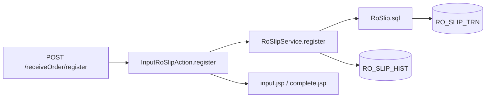
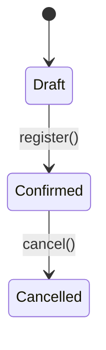
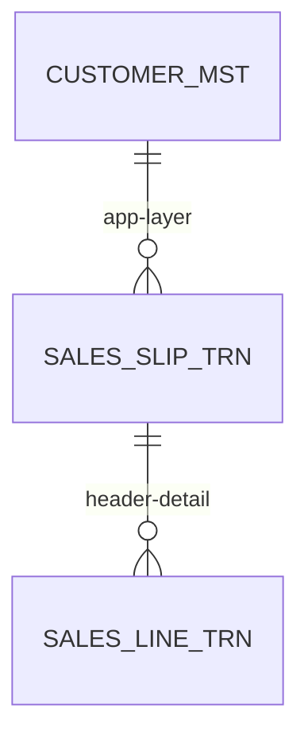

# Workflow: Reverse-engineer Legacy SalesCube Java thành Technical Documentation

## Mục tiêu

Phân tích source Java legacy của SalesCube và sinh tài liệu kỹ thuật có thể dùng làm baseline cho:

- Workflow documentation.
- Function Design.
- Prisma schema mapping.
- Java → TypeScript migration.
- Characterization tests.
- Risk assessment/cutover planning.

Tài liệu phải mô tả được:

- Kiến trúc module và entry points.
- Route → Action → Service → SQL → DB → response/side effect.
- Permission, validation, status transition, transaction boundary.
- Dependency nội module và liên module.
- JSP/JavaScript/SQL chứa logic ẩn.
- Code reachable, code không xác định reachable và code có khả năng dead code.
- Mức độ chắc chắn của mọi kết luận.

> Không sửa bất kỳ file nào trong `SalesCube/`.  
> Không coi tên class, tên method hoặc tên bảng là bằng chứng đầy đủ về behavior runtime.

---

## Quy ước Evidence

Mọi claim quan trọng phải có đúng một mức độ:

| Nhãn | Ý nghĩa |
|---|---|
| `CONFIRMED_BY_CODE` | Có bằng chứng trực tiếp từ Java/JSP/SQL/configuration |
| `CONFIRMED_BY_CONFIG` | Có bằng chứng trực tiếp từ Struts/Seasar/web config |
| `CONFIRMED_BY_DDL` | Có bằng chứng trực tiếp từ DDL/ALTER script |
| `INFERRED_FROM_CODE` | Suy luận hợp lý từ cấu trúc/call pattern nhưng không trace đầy đủ |
| `RUNTIME_DEPENDENT` | Cần runtime config/data/session/container để xác minh |
| `UNKNOWN_NEEDS_VERIFICATION` | Không đủ source/evidence để kết luận |
| `POSSIBLY_UNREACHABLE` | Tìm thấy source nhưng chưa có entry/caller được xác minh |

## Quy tắc bắt buộc

1. Mọi kết luận phải có file path + method/section + line range khi có thể.
2. Không coi mọi `*Action.java` là HTTP entry point nếu route mapping chưa xác nhận.
3. Không coi mọi `*Service.java` là business-critical nếu chưa trace từ entry point.
4. Không coi mọi SQL file là được gọi trong production flow.
5. Không coi mọi JSP là view active nếu không có forward/include/route evidence.
6. Không tự suy đoán transaction boundary từ tên method; phải đọc annotation, interceptor, transaction manager hoặc call context.
7. Không tự suy đoán stored procedure, batch, EAD, history, sequence, email hoặc file output nếu không trace được.
8. Không tự suy đoán soft-delete policy chỉ từ cột `DEL_DATETM`.
9. Không dừng batch để hỏi user; ghi vấn đề vào `_open-questions.md`.
10. Không dùng “đã phân tích toàn bộ module” nếu còn file `POSSIBLY_UNREACHABLE`, `RUNTIME_DEPENDENT` hoặc `UNKNOWN` chưa được thống kê.

---

## Output Structure

```text
output/
├── 01-reverse-engineering-overview.md
├── 02-module-inventory.md
├── 03-route-api-inventory.md
├── 04-dependency-graph.md
├── 05-data-access-inventory.md
├── 06-runtime-config-inventory.md
├── workflows/
│   ├── _index.md
│   ├── _open-questions.md
│   ├── _inventory/
│   ├── _evidence/
│   ├── _reports/
│   └── WF-XX-<name>.md
└── reverse-engineering/
    ├── _scope/
    ├── _evidence/
    ├── _reports/
    └── <module>/
        ├── 00-scope.md
        ├── 01-entry-points.md
        ├── 02-components.md
        ├── 03-dependency-trace.md
        ├── 04-business-rules.md
        ├── 05-data-access.md
        ├── 06-view-and-client-logic.md
        ├── 07-risks-and-unknowns.md
        └── 08-analysis-report.md
```

Nếu repository đã có naming/document convention khác, tuân theo convention hiện có.

---

# Phase 0 – Repository & Runtime Preflight

## Mục tiêu

Xác định framework, đường dẫn, source generation và runtime configuration trước khi scan module.

## Kiểm tra bắt buộc

- Repository root.
- Branch hiện tại và working tree.
- Java source root.
- Web application root.
- `struts-config.xml`, module config, plug-in config.
- `web.xml`.
- Seasar config:
  - `app.dicon`,
  - `s2container.dicon`,
  - DAO/service DI config,
  - transaction interceptor config.
- Build files:
  - Maven/Ant/Gradle.
- JSP/view root.
- JavaScript/static assets root.
- SQL/entity SQL root.
- DDL and ALTER scripts.
- Batch/job/scheduler config.
- Property files/environment config.
- Existing output docs.
- Test source and fixtures if any.

## Output

```text
output/reverse-engineering/_scope/preflight.md
```

Template:

```markdown
# Reverse-engineering Preflight

| Area | Source | Status | Notes |
|---|---|---|---|
| Struts config | `WEB-INF/struts-config.xml` | Found | Primary route source |
| Seasar DI | `WEB-INF/classes/app.dicon` | Found | Service bindings |
| Transaction config | `.../aop.dicon` | Partial | Runtime behavior may depend on environment |
| JSP root | `WEB-INF/jsp/` | Found | Views |
| SQL root | `entity/sql/` | Found | Named SQL |
| Batch config | `...` | Missing | Batch behavior unknown |
| DDL | `DB/sql/CREATE.sql` | Found | Schema source |
```

---

# Phase 1 – Module Scope & Reachability Inventory

## Mục tiêu

Không chỉ scan theo hậu tố file. Phải xác định file nào:

- thuộc module theo package/path,
- reachable từ entry point,
- shared dependency,
- external integration,
- unknown,
- hoặc có khả năng dead code.

## 1.1 Scope categories

| Category | Ý nghĩa |
|---|---|
| `REACHABLE_CORE` | Trace được từ confirmed entry point |
| `REACHABLE_SHARED` | Shared class được core flow gọi |
| `POSSIBLY_REACHABLE` | Có dependency/name pattern nhưng chưa trace được caller |
| `POSSIBLY_UNREACHABLE` | Không tìm thấy route/caller |
| `EXTERNAL_RUNTIME` | Được load/configure lúc runtime |
| `OUT_OF_SCOPE` | Thuộc module khác hoặc không liên quan |
| `UNKNOWN` | Không đủ thông tin phân loại |

## 1.2 File inventory

Tạo file:

```text
output/reverse-engineering/<module>/00-scope.md
```

Template:

```markdown
# Scope: <Module>

| File | Type | Reachability | Why included/excluded | Evidence |
|---|---|---|---|---|
| `InputRoSlipAction.java` | Action | REACHABLE_CORE | Mapped in Struts config | `struts-config.xml:L...` |
| `RoSlipService.java` | Service | REACHABLE_CORE | Called by Action | `InputRoSlipAction.register():L...` |
| `RoSlipDto.java` | DTO | REACHABLE_SHARED | Used in Service return type | `RoSlipService.find():L...` |
| `LegacyUtility.java` | Utility | POSSIBLY_UNREACHABLE | No caller found | Search result |
| `other/Action.java` | Action | OUT_OF_SCOPE | Different module package | Package/path |
```

## 1.3 Required scan targets

- `*Action.java`
- `*Service.java`
- `*ServiceImpl.java`
- `*Form.java`
- `*Dto.java`
- `*Entity.java`
- `entity/sql/*.sql`
- `*.jsp`
- JavaScript referenced by JSP.
- Struts/Seasar config.
- Properties/messages files.
- Batch/import/export classes.
- Tests/fixtures if present.

---

# Phase 2 – Entry Point & Route Discovery

## Mục tiêu

Xác định entry point thực tế thay vì suy luận từ tên Action method.

## Route source priority

1. `struts-config.xml` / module config.
2. `web.xml` and servlet/filter mappings.
3. Struts action mappings.
4. SAStruts `@Execute` / convention mapping, nếu project dùng.
5. JSP form action / JavaScript AJAX URL.
6. Batch scheduler/job config.
7. Runtime-generated mapping nếu không có static config.

## Route inventory

Tạo file:

```text
output/reverse-engineering/<module>/01-entry-points.md
```

Template:

```markdown
# Entry Points: <Module>

| Trigger | HTTP | Route | Action / Method | Type | Confidence | Evidence |
|---|---|---|---|---|---|---|
| User submit | POST | `/receiveOrder/register` | `InputRoSlipAction.register()` | CREATE | CONFIRMED_BY_CONFIG | `struts-config.xml:L...` |
| User search | GET/POST | `/receiveOrder/index` | `InputRoSlipAction.index()` | SEARCH | CONFIRMED_BY_CONFIG | `...` |
| Batch | — | — | `CloseBillBatch.execute()` | BATCH | CONFIRMED_BY_CONFIG | `job-config.xml:L...` |
| AJAX | POST/UNKNOWN | `/lookup/customer` | `CustomerLookupAction.search()` | AJAX | INFERRED_FROM_CODE | JSP JS call |
```

## Method classification

| Type | Description |
|---|---|
| `SCREEN_ENTRY` | Open list/form/confirm screen |
| `SEARCH` | Search/filter/query |
| `VIEW_DETAIL` | Detail display |
| `CREATE` | Create record |
| `UPDATE` | Update record |
| `CANCEL_OR_STATUS` | Cancel/approve/reject/status transition |
| `IMPORT` | File/data import |
| `EXPORT` | CSV/PDF/Excel/print |
| `AJAX` | Client-side async action |
| `BATCH` | Scheduler/job/CLI |
| `INTERNAL_HELPER` | Non-entry helper |
| `UNKNOWN` | Not classified |

## Rule

Nếu method không có route, caller hoặc runtime config evidence, đánh dấu `POSSIBLY_UNREACHABLE` hoặc `UNKNOWN`, không gọi là HTTP handler.

---

# Phase 3 – Component & Dependency Graph

## Mục tiêu

Tạo graph thể hiện dependency thực tế, tránh chỉ list class.

## Dependency types

| Edge | Meaning |
|---|---|
| `ROUTES_TO` | Route maps to Action |
| `CALLS` | Method calls method |
| `INJECTS` | DI/injection dependency |
| `QUERIES` | Service/DAO invokes SQL |
| `READS` | SQL reads table |
| `WRITES` | SQL writes table |
| `FORWARDS_TO` | Action forwards/redirects to JSP/action |
| `INCLUDES` | JSP include/tag include |
| `TRIGGERS` | Causes external/batch/event side effect |
| `CHECKS_PERMISSION` | Permission/menu check |
| `VALIDATES` | Validation rule source |

## Output

```text
output/reverse-engineering/<module>/03-dependency-trace.md
```

Template:

```markdown
# Dependency Trace: <Module>

## Main dependency graph



## Edge inventory

| From | Edge | To | Confidence | Evidence |
|---|---|---|---|---|
| `/receiveOrder/register` | ROUTES_TO | `InputRoSlipAction.register()` | CONFIRMED_BY_CONFIG | `struts-config.xml:L...` |
| `InputRoSlipAction.register()` | CALLS | `RoSlipService.register()` | CONFIRMED_BY_CODE | `...:L...` |
| `RoSlipService.register()` | QUERIES | `RoSlipInsert.sql` | CONFIRMED_BY_CODE | `...:L...` |
| `RoSlipInsert.sql` | WRITES | `RO_SLIP_TRN` | CONFIRMED_BY_SQL | `...:L...` |
```

## Cross-module dependency rule

Nếu module gọi service/module khác:

- Ghi cross-module edge.
- Không phân tích sâu source ngoài scope trừ khi behavior đó quyết định outcome.
- Tạo follow-up scope item nếu high impact.

---

# Phase 4 – Action, Service & Transaction Analysis

## 4.1 Action analysis

Với mỗi reachable Action method, ghi:

- Route/trigger.
- Request/form/session parameters.
- Permission checks.
- Service calls.
- Forward/redirect/download/JSON response.
- Exception handling.
- Direct DB/SQL access (nếu có).
- Helper methods có logic nghiệp vụ.

## Action template

```markdown
## Action: InputRoSlipAction.register()

| Aspect | Finding | Confidence | Evidence |
|---|---|---|---|
| Entry | POST `/receiveOrder/register` | CONFIRMED_BY_CONFIG | `struts-config.xml:L...` |
| Input | `InputRoSlipForm` | CONFIRMED_BY_CODE | `InputRoSlipAction.register():L...` |
| Permission | `MENU_ID.RORDER_INPUT` | CONFIRMED_BY_CODE | `BaseAction.checkMenu():L...` |
| Service call | `roSlipService.register(form)` | CONFIRMED_BY_CODE | `...:L...` |
| Success response | Forward `complete.jsp` | CONFIRMED_BY_CODE | `...:L...` |
| Error response | Return input page with message | CONFIRMED_BY_CODE | `...:L...` |
```

## 4.2 Service analysis

Trace method call chain until:

- persistence/sql,
- external boundary,
- framework boundary,
- shared module boundary,
- unresolved dynamic dispatch.

Capture:

- business rules,
- data transformations,
- validation,
- transaction annotations/interceptors,
- lock/version behavior,
- error/exception behavior,
- side effects,
- sequence allocation,
- history/audit writes.

## Transaction rule

Do not claim a transaction boundary based only on method name.

Confirm from:

- `@Transactional`,
- Seasar AOP/transaction interceptor configuration,
- DAO/service layer transaction handling,
- explicit commit/rollback code,
- framework default documented in config.

If not traceable:

```text
Transaction boundary: RUNTIME_DEPENDENT
```

---

# Phase 5 – SQL, DDL & Data Access Analysis

## Mục tiêu

Phân biệt SQL business behavior, data access and DDL fact.

## SQL analysis must capture

- SELECT, INSERT, UPDATE, DELETE.
- Tables/views.
- Join and filter conditions.
- Soft-delete predicates.
- CASE/IF expressions.
- Stored procedure/function calls.
- Lock clauses.
- Sequence allocation/update.
- Aggregations used in business decisions.
- Dynamic SQL/template substitutions.
- Pagination/order.
- Cross-schema references.

## Output

```text
output/reverse-engineering/<module>/05-data-access.md
```

Template:

```markdown
# Data Access: <Module>

| Query / Method | Operation | Tables | Business-significant logic | Confidence | Evidence |
|---|---|---|---|---|---|
| `RoSlipSelect.sql` | SELECT | `RO_SLIP_TRN`, `CUSTOMER_MST` | Filters `DEL_DATETM IS NULL` | CONFIRMED_BY_SQL | `...:L...` |
| `RoSlipInsert.sql` | INSERT | `RO_SLIP_TRN` | Inserts header | CONFIRMED_BY_SQL | `...:L...` |
| `updateSeqMaker()` | UPDATE | `SEQ_MAKER` | Allocates sequence | CONFIRMED_BY_CODE | `Service:L...` |
```

## DDL corroboration

For each confirmed table, verify:

- exact table name,
- column name,
- key/unique constraints,
- nullable/default where behavior depends on it,
- triggers/check constraints if defined.

Do not treat DDL as proof that application actually uses the table in this workflow.

## Soft-delete analysis

For each delete-related column:

```markdown
| Table | Column | Write behavior | Read filter behavior | Evidence | Conclusion |
|---|---|---|---|---|---|
| `CUSTOMER_MST` | `DEL_DATETM` | Set on delete | Often filtered in search | SQL_CONFIRMED | Soft delete likely for active views |
```

Conclusion must be `INFERRED_FROM_CODE` unless both write and read patterns are confirmed.

---

# Phase 6 – View, JSP & Client-side Logic Analysis

## Mục tiêu

Phát hiện behavior nằm ngoài Java Action/Service.

## Bắt buộc kiểm tra

- JSP scriptlet: `<% ... %>`, `<%= ... %>`.
- JSTL/EL conditional rendering.
- Custom tags.
- Hidden inputs/default values.
- Form action/method.
- JavaScript validation.
- AJAX URLs.
- Dynamic enable/disable behavior.
- Page-specific inline JS.
- Included JSP/tag files.
- Download/export/print links.
- i18n message keys and displayed error messages.

## Output

```text
output/reverse-engineering/<module>/06-view-and-client-logic.md
```

Template:

```markdown
# View & Client Logic: <Module>

| View / Asset | Logic | Impact | Confidence | Evidence |
|---|---|---|---|---|
| `input.jsp` | Hidden status field defaulted to `DRAFT` | Status behavior | CONFIRMED_BY_CODE | `input.jsp:L...` |
| `input.jsp` | Calls customer lookup AJAX | Lookup dependency | CONFIRMED_BY_CODE | `input.jsp:L...` |
| `validation.js` | Blocks submit if amount <= 0 | Client validation only | CONFIRMED_BY_CODE | `validation.js:L...` |
| tag include | Permission-based button display | UX permission | CONFIRMED_BY_CODE | `tag:L...` |
```

## Rule

Client-side validation does not prove server-side validation exists. Mark separately.

---

# Phase 7 – Business Rules, Status & Side Effects

## Mục tiêu

Tách business rule có evidence khỏi data access detail.

## Business rule extraction

Một rule phải có:

- Rule ID.
- Trigger/context.
- Condition.
- Outcome.
- Severity.
- Source/evidence.
- Confidence.

Template:

```markdown
# Business Rules: <Module>

| ID | Context | Rule | Outcome | Severity | Confidence | Evidence |
|---|---|---|---|---|---|---|
| BR-01 | Create order | Customer must be active | Block submit with error | Block | CONFIRMED_BY_CODE | `RoSlipService.validateCustomer():L...` |
| BR-02 | Search | Exclude deleted rows | Filter result | Info | CONFIRMED_BY_SQL | `RoSlipSelect.sql:L...` |
```

## Status transition analysis

Only create a state diagram when transition is confirmed.



If status values are seen but mutation path is not traceable:

```text
Status model: UNKNOWN_NEEDS_VERIFICATION
```

## Side effects inventory

Capture separately:

- `*_HIST` insert.
- `SEQ_MAKER` update.
- EAD/external slip generation.
- stock movement.
- ledger update.
- file output.
- email/notification.
- batch trigger.
- cache/session mutation.
- audit logging.

Template:

```markdown
| Side effect | Trigger | Source | Confidence | Evidence |
|---|---|---|---|---|
| Insert `RO_SLIP_HIST` | After order create | Service helper | CONFIRMED_BY_CODE | `...` |
| EAD trigger | After register | Unknown | UNKNOWN_NEEDS_VERIFICATION | No static call found |
```

---

# Phase 8 – Runtime Configuration & Dynamic Behavior

## Mục tiêu

Phát hiện các behavior không thể xác minh chỉ bằng static source.

## Kiểm tra

- Properties files.
- Environment-specific config.
- DI wiring/dynamic class binding.
- Reflection.
- Plugin loading.
- Scheduled jobs.
- DB triggers/stored procedures.
- External service URLs.
- Session/user context.
- Feature flags.
- Message/resource bundle behavior.
- Runtime permissions/role tables.

## Output

```text
output/06-runtime-config-inventory.md
```

Template:

```markdown
# Runtime Configuration Inventory

| Area | Finding | Confidence | Evidence | Follow-up |
|---|---|---|---|---|
| Transaction interceptor | Config file missing | RUNTIME_DEPENDENT | No static config found | Verify runtime/container |
| EAD endpoint | Property key exists | CONFIRMED_BY_CODE | `app.properties:L...` | Need environment value |
| Permission role mapping | DB-loaded | RUNTIME_DEPENDENT | `PermissionService.load()` | Need sample data |
```

---

# Phase 9 – Generate Technical Documentation

## Core documentation files

> **Output index chuẩn (AGENT.md):**
>
> | File | AGENT # | Publish to |
> |------|---------|------------|
> | `output/01-architecture-overview.md` | #1 | — |
> | `output/02-module-inventory.md` | #2 | `docs/spec/01-module-inventory.md` |
> | `output/03-route-api-inventory.md` | #3 | `docs/spec/08-api-contracts.md` |
> | `output/04-database-analysis.md` | #4 | — |
> | `output/05-background-jobs.md` | #5 | `docs/spec/10-batch-jobs.md` |
> | `output/06-auth-permission-analysis.md` | #6 | — |
> | `output/07-screen-route-mapping.md` | #7 | `docs/spec/05-screen-inventory.md` |
> | `output/08-business-flow-hypotheses.md` | #8 | — |
> | `output/09-external-integrations.md` | #9 | — |
> | `output/10-risks-unknowns.md` | #10 | — |
> | `output/11-service-inventory.md` | +1 | `docs/spec/09-service-inventory.md` |
> | `output/database/table-dictionary.md` | spec-11 | — |
> | `output/database/relationship-map.md` | spec-11 | — |
> | `output/database/suspected-erd.mmd` | spec-11 | — |
> | `output/database/data-lifecycle.md` | spec-11 | — |
> | `output/database/data-integrity-risks.md` | spec-11 | — |

### `output/01-architecture-overview.md`

```markdown
# SalesCube Legacy Reverse-engineering Overview

## System facts
- Framework:
- Source root:
- Route mechanism:
- DI mechanism:
- Transaction mechanism:
- SQL mechanism:
- View mechanism:
- Database source:
- Runtime-dependent areas:

## Analysis coverage
| Module | Reachable files | Unknowns | Status |
|---|---:|---:|---|
```

### `output/02-module-inventory.md`

```markdown
# Module Inventory

| Module | Actions | Services | SQL | JSP | Reachable scope | Confidence |
|---|---:|---:|---:|---:|---|---|
```

### `output/03-route-api-inventory.md`

```markdown
# Route / API Inventory

| Route | HTTP | Action | Method | Workflow | Confidence | Evidence |
|---|---|---|---|---|---|---|
```

### `output/04-dependency-graph.md`

```markdown
# Dependency Graph Index

| Module | Graph file | Cross-module dependencies | High-risk dependencies |
|---|---|---|---|
```

### `output/05-data-access-inventory.md`

```markdown
# Data Access Inventory

| Module | Table | Read/Write | Queries/Methods | Soft-delete signal | Confidence |
|---|---|---|---|---|---|
```

---

# Phase 5b – Batch & Stored Procedure Analysis

## Mục tiêu

Phân tích các batch script, shell entry points và stored procedures để xác định behavior **không thuộc HTTP flow**. Không bỏ qua phase này — batch logic thường chứa critical business rules (rank update, stock recalculation, billing close).

## Scan targets (theo thứ tự)

1. `SalesCube/DB/batch/salescube_batch/*.sh` — shell trigger scripts
2. `SalesCube/DB/batch/salescube_batch/*.sql` — SQL gọi từ shell
3. `SalesCube/DB/batch/sp/*.sql` — stored procedures
4. Java classes implement `Job`, `Runnable`, `Schedulable` hoặc có `@Scheduled` annotation (nếu tồn tại)

## Output

```text
output/reverse-engineering/05b-batch-analysis.md
```

> Nếu module không có batch, ghi rõ: `No batch entry points found for module <name>` và skip phase.

### Template batch inventory

```markdown
# Batch & SP Analysis

## Shell-triggered Batches

| Batch | Shell script | SQL/SP called | Tables READ | Tables WRITE | Schedule | Confidence | Evidence |
|---|---|---|---|---|---|---|---|
| UpdateCustomerRank | `UpdateCustomerRank.sh` | `SP_UPDATE_CUSTOMER_RANK_SALES.sql` | `SALES_SLIP_TRN`, `CUSTOMER_MST` | `CUSTOMER_MST` | UNKNOWN | CONFIRMED_BY_CODE | `batch/salescube_batch/UpdateCustomerRank.sh:L1-20` |

## Stored Procedures

| SP name | Input params | Output | Tables READ | Tables WRITE | Error handling | Transaction | Called by | Confidence |
|---|---|---|---|---|---|---|---|---|
| `SP_UPDATE_CUSTOMER_RANK_SALES` | - | - | - | - | - | UNKNOWN | shell script | CONFIRMED_BY_CODE |

## Unknowns / Open Questions
- ...
```

### Bắt buộc document với mỗi SP

- Input parameters (tên, kiểu, nullable)
- Output/result set hoặc OUT params
- Tables READ / WRITE / UPDATE (với điều kiện nếu có)
- Error handling: SIGNAL, RAISE, ROLLBACK pattern
- Transaction behavior: explicit COMMIT/ROLLBACK hay auto?
- Trigger condition: called by shell, application, DB trigger, hay không rõ

---

# Phase 9b – Database Deep Analysis

## Mục tiêu

Sinh 5 output artifacts theo yêu cầu `docs/spec/11-database_analys.md`. Phase này bắt buộc chạy sau Phase 9.

## Output files (bắt buộc tất cả 5)

```text
output/database/
├── table-dictionary.md
├── relationship-map.md
├── suspected-erd.mmd
├── data-lifecycle.md
└── data-integrity-risks.md
```

### 1. `output/database/table-dictionary.md`

Mỗi table ghi: PK, FK, unique constraints, search fields, status flag fields, soft-delete fields, audit fields, business meaning, source evidence.

```markdown
| Table | Type | PK | FK count | Soft-delete col | Audit cols | Business meaning | Evidence |
|---|---|---|---|---|---|---|---|
| `CUSTOMER_MST` | MASTER | `CUSTOMER_CD` | 0 | `DEL_DATETM` | `INS_DATETM`, `UPD_DATETM` | Customer master | DDL_CONFIRMED |
```

### 2. `output/database/relationship-map.md`

App-layer relationships (không chỉ DB FK). Gắn `APP_LAYER_ONLY` cho quan hệ không có FK constraint trong DDL.

```markdown
| From table | Column | To table | Column | Type | Enforcement | Evidence |
|---|---|---|---|---|---|---|
| `SALES_SLIP_TRN` | `CUSTOMER_CD` | `CUSTOMER_MST` | `CUSTOMER_CD` | n:1 | APP_LAYER_ONLY | SQL_CONFIRMED |
```

### 3. `output/database/suspected-erd.mmd`

Mermaid ERD diagram cho core transaction tables. Không thêm FK nếu DDL không confirm.



### 4. `output/database/data-lifecycle.md`

INSERT / UPDATE / DELETE lifecycle của mỗi table:

```markdown
| Table | INSERT by | UPDATE by | DELETE by | Delete behavior | Evidence |
|---|---|---|---|---|---|
| `SALES_SLIP_TRN` | `SalesService.register()` | `SalesService.update()` | Status cancel only | `DEL_DATETM` set | SQL_CONFIRMED |
```

### 5. `output/database/data-integrity-risks.md`

```markdown
| Risk | Table | Detail | Severity | Evidence |
|---|---|---|---|---|
| No DB FK | `SALES_SLIP_TRN.CUSTOMER_CD` | App-layer only — delete CUSTOMER_MST có thể orphan | HIGH | DDL_CONFIRMED |
| SEQ_MAKER app-allocated | `SALES_SLIP_TRN.SEQ_NO` | Concurrency risk nếu không lock | HIGH | JAVA_CONFIRMED |
```

## Nguyên tắc bắt buộc

- Không tự thêm FK vào ERD nếu DDL không confirm — ghi `APP_LAYER_ONLY`.
- Mọi quan hệ phải có provenance: `CONFIRMED_BY_DDL`, `APP_LAYER_ONLY`, `INFERRED_FROM_CODE`, `UNKNOWN`.
- Ưu tiên core transaction tables trước: `SALES_SLIP_TRN`, `RO_SLIP_TRN`, `BILL_TRN`, `DEPOSIT_SLIP_TRN`.
- Tenant suffix `_XXXXX` trong DDL: document trong `table-dictionary.md` với note "Table name has instance suffix — `@@map()` strategy needed".

---

# Phase 9c – Spec Bundle Publish

## Mục tiêu

Sau khi sinh xong `output/01–11`, copy/sync các deliverable tương ứng vào `docs/spec/` để các workflow downstream có thể tham chiếu.

## Publish map

| Source (`output/`) | Target (`docs/spec/`) |
|---|---|
| `02-module-inventory.md` | `01-module-inventory.md` |
| `03-route-api-inventory.md` | `08-api-contracts.md` |
| `05-background-jobs.md` | `10-batch-jobs.md` |
| `07-screen-route-mapping.md` | `05-screen-inventory.md` |
| `11-service-inventory.md` | `09-service-inventory.md` |

> **Không publish:** `output/database/*`, `output/01`, `output/04`, `output/06`, `output/08–10` — đây là internal RE artifacts.
> **Không publish:** `docs/spec/11` và `docs/spec/12` — giữ làm requirement baseline.
> **Nếu `docs/spec/07-db-schema.md` bị corrupt** (ví dụ toàn giá trị `IF`): regenerate từ `output/04-database-analysis.md` và `output/database/table-dictionary.md`.

## Checklist trước khi kết thúc Phase 9c

- [ ] 5 files trong publish map đã được sync
- [ ] `docs/spec/_index.md` cập nhật với provenance + ngày sync
- [ ] `docs/spec/07-db-schema.md` không còn corrupt

---

# Phase 10 – Gap Check

## G1 – Build complete scope list

From Phase 1, create:

```markdown
SCOPE LIST — <module>:
[ ] ENTRY_POINT: each confirmed/possible route, batch, import/export entry
[ ] ACTION: each reachable Action class/method
[ ] SERVICE: each reachable Service class/method
[ ] FORM_DTO: each request/response/form object used in flow
[ ] SQL: each reachable query/SQL file
[ ] DDL: each table requiring schema validation
[ ] JSP: each reachable view/include/tag
[ ] JS: each reachable client script
[ ] CONFIG: each relevant route/DI/transaction/runtime config
[ ] EXTERNAL: each integration boundary
```

## G2 – Compare output coverage

Status:

- `[x]` Analyzed with evidence.
- `[~]` Mentioned but not traced sufficiently.
- `[ ]` Not covered.
- `[S]` Skipped with documented reason.
- `[R]` Runtime-dependent.
- `[U]` Unknown.

## G3 – Resolve gaps

- Read and document missing reachable files.
- Mark out-of-scope files with reason.
- Mark dynamic/runtime-only behavior as `RUNTIME_DEPENDENT`.
- Mark inaccessible/ambiguous content as `UNKNOWN_NEEDS_VERIFICATION`.
- Create follow-up scope only for high-impact cross-module dependency.

## G4 – Gap report

```markdown
# Gap Check: <Module>

| Metric | Result |
|---|---|
| Scope coverage | X/N |
| Reachable core coverage | X/N |
| SQL/data coverage | X/N |
| View/client coverage | X/N |
| Runtime/config coverage | X/N |

## Auto-added coverage
- ...

## Skipped files
- ...

## Runtime-dependent items
- ...

## Unknown items
- ...
```

---

# Phase 11 – Review

## R1 – Re-read generated documents

Read all changed files for the module:

```text
00-scope.md
01-entry-points.md
02-components.md
03-dependency-trace.md
04-business-rules.md
05-data-access.md
06-view-and-client-logic.md
07-risks-and-unknowns.md
08-analysis-report.md
```

## R2 – Quality checklist

### Accuracy

- [ ] Every important claim has source path + anchor/line range.
- [ ] Every claim has an evidence label.
- [ ] No route is documented without mapping/caller evidence.
- [ ] No transaction boundary is claimed without configuration/code evidence.
- [ ] No table operation is claimed without SQL/persistence evidence.
- [ ] No side effect is claimed from naming convention alone.
- [ ] Inferred and runtime-dependent items are visibly separated from facts.

### Completeness

- [ ] All confirmed entry points are listed.
- [ ] All reachable Actions are analyzed.
- [ ] All business-relevant Service methods are traced.
- [ ] Relevant Forms/DTOs are documented.
- [ ] Reachable SQL files are documented.
- [ ] Relevant DDL tables are corroborated.
- [ ] Reachable JSP includes/tags are documented.
- [ ] Client-side JS/AJAX logic is checked.
- [ ] Runtime config/DI/transaction behavior is inventoried.
- [ ] Cross-module and external dependencies are documented.

### Migration readiness

- [ ] Business rules are extracted separately from code structure.
- [ ] Data access shows read/write/side effect distinctions.
- [ ] Status transitions are evidence-backed or explicitly unknown.
- [ ] Soft-delete behavior is not overclaimed.
- [ ] Sequence allocation behavior is documented.
- [ ] High-risk unknowns have follow-up items.
- [ ] Workflow docs and route inventory are updated where applicable.

## R3 – Analysis report

Create:

```text
output/reverse-engineering/<module>/08-analysis-report.md
```

Template:

```markdown
# Analysis Report: <Module>

## Summary

| Metric | Result |
|---|---|
| Confirmed findings | N |
| Inferred findings | N |
| Runtime-dependent findings | N |
| Unknown findings | N |
| Reachable core coverage | X/N |
| Overall confidence | HIGH / MEDIUM / LOW |

## High-risk findings
- ...

## Potential dead code
- ...

## Cross-module dependencies
- ...

## Required runtime verification
- ...

## Recommended next documents
- Workflow:
- Function Design:
- Prisma mapping:
- Migration:
```

---

# Open Questions

Create/update:

```text
output/workflows/_open-questions.md
```

Template:

```markdown
# Reverse-engineering Open Questions

| ID | Module | Item | Why unresolved | Suggested verification | Impact | Status |
|---|---|---|---|---|---|---|
| OQ-RO-01 | receive-order | Transaction boundary | Seasar interceptor config unresolved | Inspect runtime DI config | High | Open |
| OQ-RO-02 | receive-order | EAD side effect timing | Property key exists but no static caller | Run trace/log on test env | Medium | Open |
```

---

# Completion criteria

A module reverse-engineering package is complete only when:

1. Module scope and reachability are documented.
2. Entry points are confirmed or explicitly marked unresolved.
3. Main dependency graph is created.
4. Reachable Action → Service → SQL → DB traces are documented.
5. JSP/JavaScript hidden logic is checked.
6. Runtime/config dependencies are inventoried.
7. Business rules, status transitions and side effects are extracted with evidence.
8. Gap check reports scope coverage.
9. Unknown/runtime-dependent items are listed with verification suggestions.
10. Review report is generated and overall confidence is declared.
