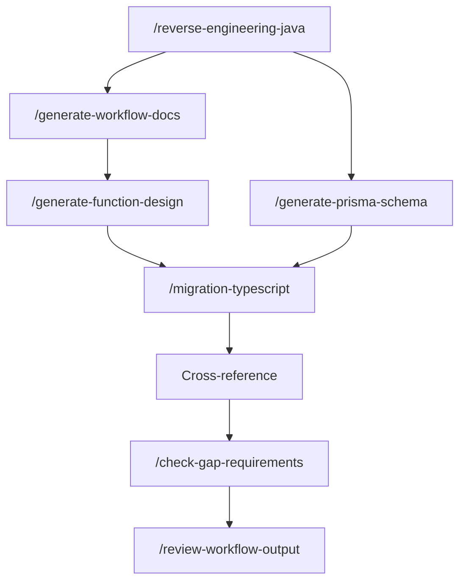

# SalesCube — Hướng dẫn Workflow Cursor

> Hướng dẫn sử dụng bộ **Cursor Skills** để reverse-engineer Java legacy và migrate sang TypeScript (NestJS + Next.js + Prisma).

---

## 1. Bắt đầu nhanh

### Đọc trước khi chạy skill

| File | Nội dung |
|------|----------|
| [CLAUDE.md](CLAUDE.md) | Domain nghiệp vụ (O2C, P2P, kho, tài chính) |
| [AGENT.md](AGENT.md) | Quy tắc RE, 10 loại output bắt buộc |
| [AGENTS.md](AGENTS.md) | Tóm tắt skills và pipeline |
| [docs/spec/_index.md](docs/spec/_index.md) | Map task spec 01–12 → skill → output |
| [docs/00.audit/audit_wf.md](docs/00.audit/audit_wf.md) | Audit workflow (gap đã patch) |

### Cách gọi skill trong Cursor

Gõ lệnh slash trong chat Agent:

```text
/reverse-engineering-java
/generate-workflow-docs
/generate-function-design
/generate-prisma-schema
/migration-typescript
/check-gap-requirements
/review-workflow-output
```

Mỗi skill có file chi tiết tại `.cursor/skills/<tên-skill>/reference-workflow.md`.

### Pipeline bắt buộc

Mọi skill **sinh output** phải tuân thứ tự:

```text
Generate → Cross-reference → Gap Check → Review → Hoàn tất
```

- **Không báo hoàn tất** nếu thiếu gap report (`docs/spec/gaps/GAP-*.md`) hoặc review (`docs/spec/reviews/REV-*.md`).
- Gap trả lời: *thiếu gì so với requirement?*
- Review trả lời: *nội dung có đúng / evidence OK?*

---

## 2. Cấu trúc thư mục output

**Mặc định Cursor:** mọi artifact RE/WF nằm tại `output/cursor/`.

```text
output/cursor/                   # Kết quả workflow Cursor
├── 01-architecture-overview.md
├── 02-module-inventory.md       → publish docs/spec/01
├── 03-route-api-inventory.md    → publish docs/spec/08
├── 04-database-analysis.md
├── 05-background-jobs.md        → publish docs/spec/10
├── 06-auth-permission-analysis.md
├── 07-screen-route-mapping.md   → publish docs/spec/05
├── 08-business-flow-hypotheses.md
├── 09-external-integrations.md
├── 10-risks-unknowns.md
├── 11-service-inventory.md      → publish docs/spec/09
├── database/                    # spec 11 requirement
├── workflows/                   # WF-XX use case docs
├── function-design/             # FD-MODULE-NN
└── reverse-engineering/<module>/  # phân tích per-module

output/README.md                 # Trỏ tới output/cursor/
```

docs/spec/                       # Spec bundle (01–12)
├── _index.md                    # Master index
├── 01-module-inventory.md … 10-batch-jobs.md
├── 11-database_analys.md        # Requirement baseline (không publish)
├── 12-bussiness-workflow.md     # Requirement baseline (không publish)
├── gaps/                        # GAP-XX reports
└── reviews/                     # REV-XX reports

output/cursor/function-design/   # FD-<MODULE>-<NN>-*.md (Cursor)
docs/function-design/            # mirror / publish (tùy chọn)
salescube-ts/                    # Code TypeScript target
.cursor/skills/                  # Skill definitions
.cursor/rules/                   # Rules persistent cho agent
```

---

## 3. Danh sách Skills

### 3.1 `/reverse-engineering-java`

**Khi dùng:** Phân tích module Java legacy lần đầu, hoặc refresh baseline sau khi có source mới.

**Output chính:** `output/cursor/01`–`11`, `output/cursor/database/*`, publish `docs/spec/01`–`10` (Phase 9.5).

| Phase | Nội dung |
|-------|----------|
| 0–8 | Scope, routes, dependency graph, SQL, JSP, business rules |
| **5b** | Deep DB analysis → `output/cursor/database/*` (theo spec 11) |
| 9 | Sinh core docs `output/cursor/01`–`11` |
| **9.5** | Publish/sync `docs/spec/01`–`10` |
| 10–11 | Gap check + Review |

**Ví dụ prompt:**

```text
/reverse-engineering-java
Phân tích module master (得意先) — package jp.co.arkinfosys.action.master.
Chạy đủ Phase 5b và 9.5 publish docs/spec.
```

---

### 3.2 `/generate-workflow-docs`

**Khi dùng:** Document một **use case** nghiệp vụ (không dump cả class).

**Output:** `output/cursor/workflows/WF-<NN>-<kebab-name>.md`

| Phase | Nội dung |
|-------|----------|
| 0–2 | Route inventory, evidence collection |
| **2.5** | Đối chiếu checklist [spec 12](docs/spec/12-bussiness-workflow.md) (12 mục) |
| 3–5 | Trace Action→Service→SQL, mermaid, sinh WF |
| 6–7 | Gap check + Review |

**Domain ưu tiên (spec 12):** customer, sales/order, billing, payment, report/export, user/permission.

**Ví dụ prompt:**

```text
/generate-workflow-docs
Sinh WF cho luồng chốt hóa đơn (CloseBillAction).
Đối chiếu spec-12 compliance matrix trước khi hoàn tất.
```

---

### 3.3 `/generate-function-design`

**Khi dùng:** Thiết kế chức năng migrate — tách rõ legacy vs target (NestJS/Zod/Prisma).

**Output:** `output/cursor/function-design/FD-<MODULE>-<NN>-*.md`

**Module prefix:** `AUTH`, `CUST`, `PROD`, `SALES`, `BILL`, `DEPOSIT`, `STOCK`, …

**Điều kiện:** Nên có WF tương ứng trong `output/cursor/workflows/` trước.

**Ví dụ prompt:**

```text
/generate-function-design
Sinh FD-CUST-01 từ WF-02 — output vào output/cursor/function-design/.
```

---

### 3.4 `/generate-prisma-schema`

**Khi dùng:** Map `CREATE.sql` → Prisma schema (evidence-first).

**Output:** `salescube-ts/packages/db/prisma/schema.prisma` + sync [docs/spec/06](docs/spec/06-prisma-schema.md) (Phase 5.5).

**Lưu ý:** Không cite `docs/spec/07-db-schema.md` nếu file chưa regenerate từ DDL (hiện có thể corrupt). Dùng `CREATE.sql` hoặc `output/cursor/database/table-dictionary.md`.

**Ví dụ prompt:**

```text
/generate-prisma-schema
Map bảng CUSTOMER_MST và CUSTOMER_MST_HIST từ CREATE.sql.
Chạy prisma validate và sync docs/spec/06.
```

---

### 3.5 `/migration-typescript`

**Khi dùng:** Implement module TypeScript với **parity matrix** trước code core.

**Output:** `salescube-ts/docs/migration/<module>/` + cập nhật [docs/spec/04](docs/spec/04-migration-map.md) (Phase 1.5).

**Điều kiện:** FD + WF + (tuỳ module) Prisma schema đã có.

**Ví dụ prompt:**

```text
/migration-typescript
Migrate module customer (FD-CUST-01). Parity matrix trước khi viết controller.
```

---

### 3.6 `/check-gap-requirements`

**Khi dùng:** **Bắt buộc** trước review — kiểm tra output đủ requirement chưa.

**Output:** `docs/spec/gaps/GAP-<NN>-<basename>.md`

**Verdict:**

| Verdict | Ý nghĩa |
|---------|---------|
| `READY_FOR_REVIEW` | Có thể chạy review |
| `NEEDS_COMPLETION` | Còn P0/P1 — bổ sung trước |
| `BLOCKED` | Thiếu source trong repo |

**Ví dụ prompt:**

```text
/check-gap-requirements
Kiểm tra gap cho docs/function-design/FD-CUST-01-customer-crud.md
```

---

### 3.7 `/review-workflow-output`

**Khi dùng:** Sau gap pass — spot-check evidence, chất lượng nội dung.

**Output:** `docs/spec/reviews/REV-<NN>-<basename>.md`

**Ví dụ prompt:**

```text
/review-workflow-output
Review output/cursor/workflows/WF-02-customer-management.md
```

---

## 4. Luồng làm việc khuyến nghị

### 4.1 Module mới (greenfield trong repo)



**Thứ tự thực tế:**

1. RE toàn module (hoặc theo package) — gồm Phase 5b + 9.5
2. WF cho từng use case quan trọng
3. FD per màn hình/API
4. Prisma schema (scope module)
5. Migration TypeScript + parity tests
6. Gap → Review cho từng artifact

### 4.2 Chỉ cần tài liệu (không code)

```text
RE → WF → (tuỳ chọn FD) → Gap → Review
```

### 4.3 Chỉ migrate một API đã có FD

```text
/migration-typescript + FD path
→ parity matrix → implement → gap → review
```

---

## 5. Cross-reference (trước Gap Check)

Đối chiếu bắt buộc:

| Kiểm tra | Nguồn |
|----------|-------|
| Index tổng | [docs/spec/_index.md](docs/spec/_index.md) |
| Business rules | WF ↔ [docs/spec/03-business-rules.md](docs/spec/03-business-rules.md) |
| Entity/field | FD ↔ [docs/spec/02-entity-list.md](docs/spec/02-entity-list.md) |
| Route/API | [output/cursor/03-route-api-inventory.md](output/cursor/03-route-api-inventory.md) ↔ [docs/spec/08](docs/spec/08-api-contracts.md) |
| DDL | [output/cursor/database/*](output/cursor/database/) ↔ spec 07 (sau regenerate) |

---

## 6. Provenance (nhãn bắt buộc)

Mọi kết luận quan trọng phải gắn nhãn — **không bịa business rules**.

| Ngữ cảnh | Nhãn |
|----------|------|
| RE / WF | `CONFIRMED_BY_CODE`, `CONFIRMED_BY_CONFIG`, `CONFIRMED_BY_DDL`, `INFERRED_FROM_CODE`, `UNKNOWN_NEEDS_VERIFICATION` |
| WF (Java trace) | `JAVA_CONFIRMED`, `SQL_CONFIRMED`, `DDL_CONFIRMED` |
| FD / Migration | `LEGACY_CONFIRMED`, `TARGET_DECISION`, `ASSUMPTION`, `PARITY_VERIFIED` |
| Prisma | `DDL_CONFIRMED`, `TARGET_DECISION` |

**Trích dẫn đúng format:** `ClassName.java:L10-L45` hoặc `path/file.sql:L72-L84`

---

## 7. Quy tắc cứng (không vi phạm)

1. **Không sửa** source trong `SalesCube/` (legacy read-only).
2. **Không** map tự động: `Action` → REST endpoint, `DEL_DATETM` → soft delete, `SEQ_MAKER` → autoincrement.
3. **Không** coi tên class/method/bảng là evidence đủ về runtime behavior.
4. **Parity matrix** bắt buộc trước khi implement logic nghiệp vụ core.
5. Backend target là **NestJS** — không dùng tRPC.
6. **Không** dùng production credentials.

Chi tiết: [.cursor/rules/05-agent-rules.mdc](.cursor/rules/05-agent-rules.mdc)

---

## 8. Map docs/spec 01–12

| # | File | Vai trò | Skill |
|---|------|---------|-------|
| 01 | module-inventory | Deliverable | RE → publish |
| 02 | entity-list | Deliverable | RE + Prisma |
| 03 | business-rules | Deliverable | RE Phase 7 |
| 04 | migration-map | Deliverable | Migration Phase 1.5 |
| 05 | screen-inventory | Deliverable | RE → publish |
| 06 | prisma-schema | Target design doc | Prisma Phase 5.5 |
| 07 | db-schema | Deliverable (DDL list) | RE Phase 5b/9.5 |
| 08 | api-contracts | Deliverable | RE → publish |
| 09 | service-inventory | Deliverable | RE `output/cursor/11` |
| 10 | batch-jobs | Deliverable | RE → publish |
| 11 | database_analys | **Requirement** | RE Phase 5b |
| 12 | bussiness-workflow | **Requirement** | WF Phase 2.5 |

Spec **11** và **12** là checklist requirement — không publish thành deliverable.

---

## 9. Troubleshooting

### Agent báo hoàn tất nhưng không có GAP/REV

```text
/check-gap-requirements <path output vừa tạo>
/review-workflow-output <path output vừa tạo>
```

### `docs/spec/07-db-schema.md` có dữ liệu sai (`IF`)

Chạy lại RE Phase 9.5 — regenerate từ `SalesCube/DB/sql/createtable/CREATE.sql`.

### FD thiếu business rule

Kiểm tra WF tương ứng và `docs/spec/03-business-rules.md`; bổ sung evidence từ Java/SQL.

### Prisma validate fail

Chạy `/generate-prisma-schema` Phase 5; xem `mappings/_open-questions.md`.

### Migration không khớp legacy

Ưu tiên bổ sung `02-parity-matrix.md` và characterization tests trước khi sửa code.

---

## 10. Tài liệu tham khảo thêm

| Tài liệu | Mô tả |
|----------|-------|
| [docs/spec/99-salescube-typescript-migration-plan.md](docs/spec/99-salescube-typescript-migration-plan.md) | Kế hoạch migrate tổng thể |
| [docs/spec/glossary.md](docs/spec/glossary.md) | Thuật ngữ |
| [.cursor/skills/](.cursor/skills/) | Skill definitions + reference workflows |
| [.cursor/rules/03-workflow-pipeline.mdc](.cursor/rules/03-workflow-pipeline.mdc) | Rule pipeline always-on |

---

## 11. Ví dụ session đầy đủ

```text
# Bước 1 — Baseline module customer
/reverse-engineering-java
Scope: master/customer (EditCustomerAction, SearchCustomerAction, CustomerService).
Phase 5b + 9 + 9.5.

# Bước 2 — Workflow use case
/generate-workflow-docs
WF-02 customer CRUD — spec-12 matrix.

# Bước 3 — Function design
/generate-function-design
FD-CUST-01 từ WF-02.

# Bước 4 — QA
/check-gap-requirements output/cursor/function-design/FD-CUST-01-customer-crud.md
/review-workflow-output output/cursor/function-design/FD-CUST-01-customer-crud.md

# Bước 5 — (khi sẵn sàng code)
/generate-prisma-schema scope customer tables
/migration-typescript module customer từ FD-CUST-01
```

---

*Cập nhật theo audit workflow 2026-06-23 — xem [docs/00.audit/audit_wf.md](docs/00.audit/audit_wf.md) để biết chi tiết gap và patch đã áp dụng.*
