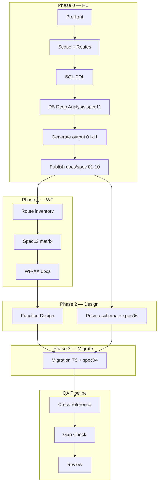

# Audit Workflow Cursor vs docs/spec 01–12

> **Ngày audit:** 2026-06-23  
> **Phạm vi:** 7 Cursor skills (`.cursor/skills/`), `docs/spec/01`–`12`, `output/`, `AGENT.md`  
> **Hành động sau audit:** Patch SKILL.md + reference-workflow.md (không đồng bộ `.devin/`)

---

## 1. Executive Summary

| Chỉ số | Giá trị |
|--------|---------|
| Spec tasks (01–12) | 12 |
| Deliverable hoàn chỉnh | 8/10 (01–06, 08–10) |
| Prompt/requirement only | 2 (11, 12) |
| Spec corrupt | 1 (`07-db-schema.md`) |
| Cursor skills | 7 |
| Coverage workflow → spec | **~58%** (7/12 có step rõ ràng trước patch) |
| Verdict tổng thể | **NEEDS_WORKFLOW_PATCH** — đã patch trong commit này |

### P0 gaps (trước patch)

| ID | Mô tả | Trạng thái sau patch |
|----|-------|----------------------|
| GAP-WF-01 | RE skill không publish `docs/spec/` dù rule pipeline ghi rõ | Phase 9.5 thêm vào RE |
| GAP-WF-02 | Spec 11 (DB deep analysis) không có phase RE | Phase 5b thêm vào RE |
| GAP-WF-03 | `docs/spec/07-db-schema.md` corrupt (toàn `IF`) | Phase 9.5 mandate regenerate từ DDL |
| GAP-WF-04 | Service inventory không có output RE Phase 9 | `output/11-service-inventory.md` + publish → spec/09 |
| GAP-WF-05 | WF skill không đối chiếu checklist spec 12 | Phase 2.5 thêm vào WF |
| GAP-WF-06 | Prisma không sync `docs/spec/06` | Phase 5.5 thêm vào Prisma |
| GAP-WF-07 | Migration map không có skill step | Phase 1.5 thêm vào Migration |
| GAP-WF-08 | Gap matrix thiếu SPEC-* items | Section SPEC thêm vào gap requirements |

### P1 gaps (ghi nhận, chưa regenerate content)

| ID | Mô tả |
|----|-------|
| GAP-WF-P1-01 | `docs/spec/08` — nhiều AJAX Action thiếu URL (`-`) |
| GAP-WF-P1-02 | `output/database/suspected-erd.md` vs spec 11 yêu cầu `.mmd` |
| GAP-WF-P1-03 | RE output numbering cũ (`01-reverse-engineering-overview`) vs repo thực tế (`01-architecture-overview`) |
| GAP-WF-P1-04 | `docs/spec/01-10` chưa được re-sync từ `output/` sau patch workflow |

---

## 2. Ma trận spec 01–12 ↔ Workflow

| # | File spec | Loại | Trạng thái nội dung | Skill | Output chính | Workflow status (sau patch) |
|---|-----------|------|---------------------|-------|--------------|----------------------------|
| 01 | `01-module-inventory.md` | Deliverable | Có — 194 Actions | `/reverse-engineering-java` | `output/02-module-inventory.md` | **MET** — Phase 9 + 9.5 publish |
| 02 | `02-entity-list.md` | Deliverable | Có — 76 entity | RE Phase 5 + `/generate-prisma-schema` | `output/05-data-access-inventory.md` | **MET** — Phase 9.5 publish |
| 03 | `03-business-rules.md` | Deliverable | Có — Constants | RE Phase 7 | Module `04-business-rules.md` | **MET** — Phase 9.5 aggregate |
| 04 | `04-migration-map.md` | Deliverable | Có | `/migration-typescript` Phase 1.5 | — | **MET** — Phase 1.5 maintain |
| 05 | `05-screen-inventory.md` | Deliverable | Có — 212 JSP | RE Phase 6 | `output/07-screen-route-mapping.md` | **MET** — Phase 9.5 publish |
| 06 | `06-prisma-schema.md` | Target design | Có — 19 tables P1 | `/generate-prisma-schema` Phase 5.5 | `schema.prisma` | **MET** — Phase 5.5 sync doc |
| 07 | `07-db-schema.md` | Deliverable | **CORRUPT** (`IF`) | RE Phase 5b + Prisma Phase 1 | `output/04-database-analysis.md` | **PARTIAL** — Phase 9.5 regenerate bắt buộc |
| 08 | `08-api-contracts.md` | Deliverable | PARTIAL (URL gaps) | RE Phase 2/9 | `output/03-route-api-inventory.md` | **MET** — Phase 9.5 publish |
| 09 | `09-service-inventory.md` | Deliverable | Có — 106 service | RE Phase 4/9 | `output/11-service-inventory.md` | **MET** — Phase 9 output mới |
| 10 | `10-batch-jobs.md` | Deliverable | Có | RE Phase 0/9 | `output/05-background-jobs.md` | **MET** — Phase 9.5 publish |
| 11 | `11-database_analys.md` | **Requirement baseline** | Prompt task | RE Phase 5b | `output/database/*` (5 files) | **MET** — Phase 5b mandate |
| 12 | `12-bussiness-workflow.md` | **Requirement baseline** | Prompt task | `/generate-workflow-docs` Phase 2.5 | `output/workflows/WF-*.md` (15 files) | **MET** — compliance matrix |

**Lưu ý:** Spec 11 và 12 **không** được publish thành deliverable — giữ làm requirement baseline cho gap check.

### AGENT.md outputs ngoài spec 01–12

| AGENT.md # | Chủ đề | File `output/` | Skill |
|------------|--------|----------------|-------|
| 1 | Architecture | `01-architecture-overview.md` | RE Phase 9 |
| 6 | Auth | `06-auth-permission-analysis.md` | RE Phase 4/8 |
| 8 | Business workflow candidates | `08-business-flow-hypotheses.md` | RE Phase 7 + WF |
| 9 | External integrations | `09-external-integrations.md` | RE Phase 8 |
| 10 | Risks | `10-risks-unknowns.md` | RE Phase 7/11 |

---

## 3. Audit từng Skill

### 3.1 `/reverse-engineering-java`

| Hạng mục | Trước audit | Sau patch |
|----------|-------------|-----------|
| Phases | 0–11 | 0–11 + **5b**, **9.5** |
| Output index | `01-06` generic | Khớp AGENT.md 10 outputs + `database/*` |
| `docs/spec/` publish | Không | Phase 9.5 |
| Spec 11 coverage | Không | Phase 5b |
| Service inventory | Phase 4 only | `output/11-service-inventory.md` |
| Gap/Review | Phase 10–11 | Giữ nguyên + baseline SPEC |

**Provenance:** `CONFIRMED_BY_CODE`, `CONFIRMED_BY_CONFIG`, `CONFIRMED_BY_DDL`, `INFERRED_FROM_CODE`, `RUNTIME_DEPENDENT`, `UNKNOWN_NEEDS_VERIFICATION`, `POSSIBLY_UNREACHABLE`

### 3.2 `/generate-workflow-docs`

| Hạng mục | Trước audit | Sau patch |
|----------|-------------|-----------|
| Phases | 0–7 | 0–7 + **2.5** (spec-12 matrix) |
| Spec 12 checklist | Chỉ cite tên file trong gap skill | 12 mục bắt buộc per WF |
| WF hiện có | 15 files | Đủ 7 domain ưu tiên spec 12 |

**Provenance:** `JAVA_CONFIRMED`, `SQL_CONFIRMED`, `DDL_CONFIRMED`, `WF_CONFIRMED`, `INFERRED`, `UNKNOWN`

### 3.3 `/generate-function-design`

| Hạng mục | Đánh giá |
|----------|----------|
| Phases | 0–7 — **đủ**, không cần patch lớn |
| Cross-ref spec | Preflight đọc `08`, `05` — OK |
| Gap | FD matrix đủ trong `reference-requirements-by-type.md` |

### 3.4 `/generate-prisma-schema`

| Hạng mục | Trước audit | Sau patch |
|----------|-------------|-----------|
| Phases | 0–8 | 0–8 + **5.5** (spec/06 sync) |
| Cite `07-db-schema` | Có — **nguy hiểm** khi file corrupt | Phase 5.5 cảnh báo preflight |
| Output doc | Chỉ `schema.prisma` | + `docs/spec/06-prisma-schema.md` |

### 3.5 `/migration-typescript`

| Hạng mục | Trước audit | Sau patch |
|----------|-------------|-----------|
| Phases | 0–9 | 0–9 + **1.5** (migration map) |
| `docs/spec/04` | Không maintain | Phase 1.5 cập nhật priority/mapping |

### 3.6 `/check-gap-requirements`

| Hạng mục | Trước audit | Sau patch |
|----------|-------------|-----------|
| Baseline WF | Cite `12-bussiness-workflow.md` | + checklist 12 mục đầy đủ |
| Baseline RE | `AGENT.md` only | + SPEC publish checklist |
| Section SPEC | Không | **SPEC-R01..R12** |

### 3.7 `/review-workflow-output`

| Hạng mục | Đánh giá |
|----------|----------|
| Pipeline | Đúng — sau gap READY_FOR_REVIEW |
| Thay đổi | Không patch — dùng SPEC matrix từ gap skill |

---

## 4. Naming & Path Inconsistencies

| Vấn đề | Chi tiết | Khuyến nghị |
|--------|----------|-------------|
| RE output numbering | Skill cũ: `01-reverse-engineering-overview`, `04-dependency-graph`, `05-data-access`, `06-runtime-config` | Chuẩn hóa theo AGENT.md + repo thực tế (đã patch SKILL.md) |
| Batch jobs filename | `output/05-background-jobs.md` vs `docs/spec/10-batch-jobs.md` | Publish alias trong Phase 9.5 |
| Service inventory slot | `09-external-integrations.md` chiếm slot AGENT #9 | Service → `output/11-service-inventory.md` |
| ERD extension | `suspected-erd.md` vs spec 11 `.mmd` | Phase 5b chuẩn `.mmd`; giữ `.md` legacy nếu có frontmatter mermaid |
| Pipeline rule vs skill | `03-workflow-pipeline.mdc` ghi `docs/spec/` cho RE | Đã align Phase 9.5 |

---

## 5. Chất lượng Spec hiện tại

### 5.1 `07-db-schema.md` — CORRUPT

Toàn bộ 129 dòng table list ghi `IF` thay vì tên bảng thực. **Prisma skill cite file này làm nguồn** — rủi ro P0.

**Nguồn đúng:** `SalesCube/DB/sql/createtable/CREATE.sql`, `output/04-database-analysis.md`, `output/database/table-dictionary.md`

### 5.2 `08-api-contracts.md` — PARTIAL

Nhiều AJAX Action có URL `-` (convention chưa resolve). `output/03-route-api-inventory.md` đáng tin hơn khi có Struts evidence.

### 5.3 `11-database_analys.md` / `12-bussiness-workflow.md`

Đây là **task prompts**, không phải deliverable. Workflow phải:
- 11 → mandate `output/database/*` (Phase 5b)
- 12 → compliance matrix per WF (Phase 2.5)

---

## 6. Tóm tắt Patch đã áp dụng

| File | Thay đổi |
|------|----------|
| `.cursor/skills/reverse-engineering-java/SKILL.md` | Output index AGENT.md; Phase 5b, 9.5; renumber gap/review |
| `.cursor/skills/reverse-engineering-java/reference-workflow.md` | Chi tiết Phase 5b, 9 mở rộng, 9.5 publish |
| `.cursor/skills/generate-workflow-docs/SKILL.md` | Phase 2.5 |
| `.cursor/skills/generate-workflow-docs/reference-workflow.md` | Spec-12 compliance matrix |
| `.cursor/skills/generate-prisma-schema/SKILL.md` | Phase 5.5 |
| `.cursor/skills/generate-prisma-schema/reference-workflow.md` | Template spec/06 |
| `.cursor/skills/migration-typescript/SKILL.md` | Phase 1.5 |
| `.cursor/skills/migration-typescript/reference-workflow.md` | Maintain spec/04 |
| `.cursor/skills/check-gap-requirements/reference-requirements-by-type.md` | Section SPEC + WF-X02 |
| `.cursor/rules/03-workflow-pipeline.mdc` | Cross-reference + spec publish |
| `docs/spec/_index.md` | Master index 01–12 |

---

## 7. Pipeline end-to-end (khuyến nghị)

**Thứ tự skill cho module mới:**

1. `/reverse-engineering-java` (gồm 5b, 9, 9.5)
2. `/generate-workflow-docs` (gồm 2.5)
3. `/generate-function-design`
4. `/generate-prisma-schema` (gồm 5.5)
5. `/migration-typescript` (gồm 1.5)
6. `/check-gap-requirements` → `/review-workflow-output`

---

## 8. Action Items (sau patch workflow)

### P0 — Cần chạy skill thực tế

- [ ] Chạy RE Phase 9.5 để **regenerate `docs/spec/07-db-schema.md`** từ `CREATE.sql`
- [ ] Re-sync `docs/spec/01-10` từ `output/` với provenance
- [ ] Đổi tên/copy `output/database/suspected-erd.md` → `suspected-erd.mmd` nếu cần strict spec 11

### P1 — Cải thiện chất lượng

- [ ] Bổ sung URL cho AJAX trong `docs/spec/08` từ Struts config
- [ ] Tạo gap reports `docs/spec/gaps/` cho output hiện có
- [ ] Review 15 WF files theo spec-12 matrix mới

### P2 — Nice to have

- [ ] Thêm `docs/spec/glossary.md` vào cross-reference index
- [ ] Link `99-salescube-typescript-migration-plan.md` trong `_index.md`

---

## 9. Kết luận

Workflow Cursor **đủ cho migration có kiểm soát** sau khi bổ sung Phase 5b, 9.5 (RE), 2.5 (WF), 5.5 (Prisma), 1.5 (Migration) và matrix SPEC trong gap check.

Điểm yếu còn lại nằm ở **chất lượng deliverable** (`07` corrupt, `08` partial), không phải thiếu skill step — cần chạy lại RE publish sau khi patch workflow.

**Verdict:** `WORKFLOW_PATCHED` — sẵn sàng chạy pipeline trên module tiếp theo.
