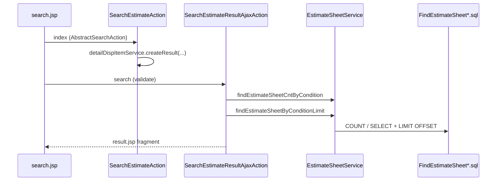
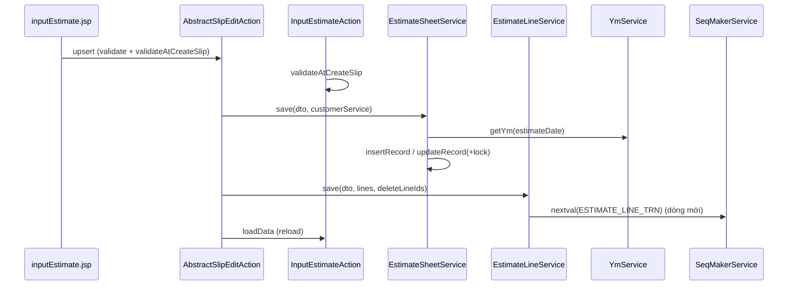

# Technical (As-Is) – estimate (見積)

> Tài liệu **KỸ THUẬT HIỆN TRẠNG (as-is)** — mô tả module *đang hoạt động thế nào* trong codebase Java/Seasar2.
> Template BẮT BUỘC: giữ nguyên thứ tự & tiêu đề. Thiếu thông tin → `[CẦN XÁC NHẬN]`, KHÔNG bịa.
> Bám sát source thật; KHÔNG bỏ qua tầng Service (logic chính nằm ở Service, không phải Action).

## 0. Metadata
| Thuộc tính | Giá trị |
|-----------|---------|
| Module | estimate (見積) |
| Agent thực hiện | cursor |
| Ngày | 2026-07-20 |
| Nguồn (scope) | xem `docs/modules/estimate.md` |
| Loại tài liệu | Technical / As-Is (Java + Seasar2 + S2Struts) |

## 1. Kiến trúc & tầng liên quan
Module estimate tuân kiến trúc phân tầng SalesCube:

```
[JSP View] → [Action (@Execute)] → [Service] → [Entity + SQL file]
                 ↑
            [Form] / [DTO]
```

- **Action**: điều phối request/response, gọi Service; CRUD phiếu kế thừa `AbstractSlipEditAction`.
- **Form**: bean màn hình + annotation validation S2Struts.
- **DTO**: `InputEstimateDto` / `InputEstimateLineDto` truyền giữa Action↔Service; search dùng `BeanMap` / `SearchEstimateDto`.
- **Service**: `EstimateSheetService` (Slip), `EstimateLineService` (Line) — nơi xử lý YM, customer ZIP, insert/update/delete, sequence dòng.
- **Entity / SQL**: `EstimateSheetTrn`, `EstimateLineTrn` + `entity/sql/estimate/*.sql` (S2Dao SQL file).
- **View**: JSP dưới `WEB-INF/view/estimate/**` và `ajax/estimate/**`.

## 2. Danh mục thành phần (inventory)
| Tầng | Class / File | Vai trò |
|------|--------------|---------|
| Action | `action/estimate/SearchEstimateAction` | Khởi tạo màn tìm + cột kết quả |
| Action | `action/estimate/InputEstimateAction` | Nhập phiếu; `validateAtCreateSlip`; gắn Sheet/Line/Customer/Category service |
| Action | `action/estimate/SearchEstimateResultOutputAction` | Xuất Excel kết quả tìm |
| Action | `action/estimate/OutputEstimateSheetSingleAction` | Xuất PDF report `0000B` |
| Action | `action/estimate/DispProductPriceListAction` | Tra đơn giá + discount |
| Action | `action/ajax/estimate/SearchEstimateResultAjaxAction` | Count + search phân trang AJAX |
| Action | `action/ajax/estimate/CheckEstimateSheetAction` | AJAX exists số phiếu |
| Form | `form/estimate/SearchEstimateForm` | Điều kiện tìm |
| Form | `form/estimate/InputEstimateForm` | Form nhập phiếu + dòng |
| Form | `form/estimate/DispProductPriceListForm` | Form tra giá |
| DTO | `dto/estimate/InputEstimateDto` | DTO đầu phiếu |
| DTO | `dto/estimate/InputEstimateLineDto` | DTO dòng |
| DTO | `dto/estimate/SearchEstimateDto` / `SearchEstimateResultDto` | DTO tìm / kết quả (bổ trợ) |
| Service | `service/EstimateSheetService` | CRUD/search/lock đầu phiếu |
| Service | `service/EstimateLineService` | CRUD dòng + sequence |
| Base | `AbstractSlipService` / `AbstractLineService` / `AbstractSlipEditAction` | Khung upsert/delete/copy/lock |
| Entity | `entity/EstimateSheetTrn` | Bảng `ESTIMATE_SHEET_TRN` |
| Entity | `entity/EstimateLineTrn` | Bảng `ESTIMATE_LINE_TRN` |
| Entity | `entity/Discount` | Master chiết khấu (màn tra giá) |
| Entity | `entity/join/EstimateLineProductJoin` | Line + join `PRODUCT_MST` |
| SQL | `entity/sql/estimate/*.sql` (13 file) | SELECT/INSERT/UPDATE/DELETE/LOCK |
| View | `view/estimate/searchEstimate/search.jsp` | Màn tìm |
| View | `view/estimate/inputEstimate/inputEstimate.jsp` | Màn nhập |
| View | `view/estimate/dispProductPriceList/dispProductPriceList.jsp` | Tra giá |
| View | `view/estimate/searchEstimateResultOutput/{excel,resultList}.jsp` | Excel |
| View | `view/ajax/estimate/searchEstimateResultAjax/result.jsp` | Fragment kết quả AJAX |
| DB | `DB/sql/createtable/CREATE.sql` | DDL `ESTIMATE_*_TRN_XXXXX` + HIST + trigger |

## 3. Sơ đồ luồng gọi (call flow)

### Tìm kiếm + AJAX


### Nhập / lưu phiếu


### PDF / Excel / Check / Price
| Chức năng | Call flow |
|-----------|-----------|
| Excel | `SearchEstimateResultOutputAction#excel` → `EstimateSheetService.findEstimateSheetByCondition` (`rowCount=null`) → `excel.jsp` |
| PDF | `OutputEstimateSheetSingleAction#pdf` → `AbstractReportWriterAction.pdf` → `findEstimateSheetByIdSimple` + `findEstimateLinesBySheetIdSimple` → report `0000B` |
| Exists | `CheckEstimateSheetAction#exists` → `EstimateSheetService.loadBySlipId` → JSON `{estimateSheetId}` hoặc null |
| Tra giá | `DispProductPriceListAction#show` → `ProductService.findById` → `DiscountRelService.findDiscountMstByProduct` → `DiscountTrnService.findDiscountTrnByDiscountId` |

## 4. Chi tiết logic Service

### 4.1 `EstimateSheetService`
- **Inject:** `YmService`.
- **`save(dto, abstractServices)`:**
  1. Cast `abstractServices[0]` → `CustomerService`.
  2. `ymService.getYm(dto.estimateDate)` → gán `estimateAnnual/Monthly/Ym` (hoặc `""` nếu null).
  3. Nếu có `customerCode` và tìm được customer → `dto.deliveryZipCode = c.customerZipCode`.
  4. `newData == null || newData` → `insertRecord`; else `updateRecord` (có lock).
- **`insertRecord`:** `Beans` copy DTO→`EstimateSheetTrn`, convert date → `InsertEstimateSheet.sql`.
- **`updateRecord`:** convert date/`updDatetm` → lock → `UpdateEstimateSheet.sql`.
- **`loadBySlipId`:** `FindEstimateSheetById.sql` → copy sang `InputEstimateDto`.
- **Search:** `setConditionParam` dựng LIKE/date/sort; `findEstimateSheetByCondition` / `…Limit` / `…Cnt` / `…FromCopySlip` (thêm điều kiện `CUSTOMER_CODE != ""`).
- **`deleteById`:** lock rồi `DeleteEstimateSheet.sql` (physical delete).

### 4.2 `EstimateLineService`
- **Inject:** `SeqMakerService`.
- **`save(slipDto, lineList, deletedLineIds, …)`:**
  1. Với mỗi dòng: gán `estimateSheetId`, `lineNo = 1..n`.
  2. Không có `estimateLineId` → `seqMakerService.nextval("ESTIMATE_LINE_TRN")` → insert.
  3. Có ID → update.
  4. `deletedLineIds` CSV → `updateAudit` rồi `DeleteEstimateLinesByLineIds.sql`.
- **`loadBySlip`:** `FindEstimateLinesBySheetId.sql` → `EstimateLineProductJoin` → DTO list.
- **`deleteRecords(sheetId)`:** `DeleteEstimateLinesBySheetId.sql`.

### 4.3 Khung Action (`AbstractSlipEditAction`) — không bỏ qua
- `index` / `load` / `upsert` / `delete` / `copy` / `errorInit`.
- `upsert`: validate → `copyToDto` → `upsertInitialize` → `setSlipTaxRate` → `removeBlankLine` → `slipService.save` → `lineService.save` → `loadData` → message insert/update.
- `delete`: audit slip → delete slip → audit lines → delete lines → message delete.
- `copy`: load → `InputEstimateForm#initCopy` (xoá ID/audit) → `initialize`.

### 4.4 `InputEstimateAction#validateAtCreateSlip`
Business validation chính (xem Requirements BR-01…BR-10): ngày, customer tồn tại, bắt buộc dòng/SL/giá, maxlength, num0, range, exceptional product.

## 5. Mô hình dữ liệu (Entity / bảng DB / SQL)
| Bảng | Entity | Khoá chính | Quan hệ |
|------|--------|-----------|---------|
| `ESTIMATE_SHEET_TRN` (suffix domain `_XXXXX`) | `EstimateSheetTrn` | `ESTIMATE_SHEET_ID` VARCHAR(32) | Slip 1–N Line |
| `ESTIMATE_LINE_TRN` | `EstimateLineTrn` | `ESTIMATE_LINE_ID` INT UNSIGNED | N thuộc 1 Sheet |
| `ESTIMATE_*_TRN_HIST` | (không map entity scope) | `HIST_ID` | Trigger INS/UPD/DEL ghi lịch sử |
| `DISCOUNT` / quan hệ SP | `Discount` (+ services ngoài) | `discountId` | Chỉ dùng tra giá |

**Cột nghiệp vụ quan trọng (Sheet):** `ESTIMATE_DATE`, `VALID_DATE`, `ESTIMATE_ANNUAL/MONTHLY/YM`, `SUBMIT_*`, `CUSTOMER_*`, `DELIVERY_ZIP_CODE`, `CTAX_*`, `COST_TOTAL`, `RETAIL_PRICE_TOTAL`, `ESTIMATE_TOTAL`, `TAX_FRACT_CATEGORY`, `PRICE_FRACT_CATEGORY`, audit `CRE_*`/`UPD_*`/`DEL_*`.

**Cột Line:** `LINE_NO`, `PRODUCT_CODE`, `PRODUCT_ABSTRACT`, `QUANTITY`, `UNIT_COST`, `UNIT_RETAIL_PRICE`, `COST`, `RETAIL_PRICE`, `REMARKS`, audit.

**Lưu ý:** Entity Sheet có nhiều cột `DELIVERY_*` địa chỉ/liên hệ, nhưng `InsertEstimateSheet.sql` / `UpdateEstimateSheet.sql` **chỉ ghi** tới `DELIVERY_NAME` + `DELIVERY_ZIP_CODE` (và các field nghiệp vụ khác đã liệt kê) — các cột địa chỉ còn lại không đi qua SQL này.

**SQL inventory (`entity/sql/estimate/`):**
| File | Thao tác |
|------|----------|
| `InsertEstimateSheet.sql` | INSERT sheet |
| `UpdateEstimateSheet.sql` | UPDATE sheet |
| `DeleteEstimateSheet.sql` | DELETE sheet by id |
| `LockEstimateSheet.sql` | `SELECT UPD_DATETM, UPD_USER … FOR UPDATE` |
| `FindEstimateSheetById.sql` | Load sheet edit |
| `FindEstimateSheetByCondition.sql` | Search + margin + optional LIMIT |
| `FindEstimateSheetCntByCondition.sql` | COUNT |
| `FindEstimateSheetFromCopySlipByCondition.sql` | Search copy-slip (`CUSTOMER_CODE != ""`) |
| `InsertEstimateLine.sql` | INSERT line |
| `UpdateEstimateLine.sql` | UPDATE line |
| `DeleteEstimateLinesBySheetId.sql` | DELETE lines by sheet |
| `DeleteEstimateLinesByLineIds.sql` | DELETE lines by ids |
| `FindEstimateLinesBySheetId.sql` | Lines + left join product |
| `FindEstimateLinesByLineIds.sql` | Lines by ids |

## 6. Điểm vào (endpoints)
S2Struts quy ước path ≈ `/estimate/{action}/{method}` (và `/ajax/estimate/...`). Exact struts routing file ngoài một phần JSP: `[CẦN XÁC NHẬN]` nếu cần path tuyệt đối production.

| Method (`@Execute`) | Trigger UI | Input (Form/Param) | Kết quả/điều hướng |
|---------------------|-----------|--------------------|--------------------|
| `SearchEstimateAction` index (inherited) | Mở màn tìm | `SearchEstimateForm` | `search.jsp` |
| `SearchEstimateResultAjaxAction` search (inherited) | Nút tìm / đổi trang | `SearchEstimateForm` | `Mapping.RESULT` JSP fragment |
| `SearchEstimateResultOutputAction#excel` | Xuất Excel | `SearchEstimateForm` | `Mapping.EXCEL` → `excel.jsp` |
| `AbstractSlipEditAction#index` | Mở nhập mới | `InputEstimateForm` | `inputEstimate.jsp` |
| `#load` | Mở phiếu theo id | `estimateSheetId` | load sheet+lines |
| `#upsert` | Đăng ký / cập nhật | Form + lines | validate → save → reload JSP |
| `#delete` | Xoá | Form | delete sheet+lines → index-like |
| `#copy` | Copy | `estimateSheetId` | form initCopy |
| `CheckEstimateSheetAction#exists` | Blur/check số phiếu | `estimateSheetId` | JSON hoặc null |
| `OutputEstimateSheetSingleAction#pdf` | Nút PDF | `InputEstimateForm` | PDF stream |
| `DispProductPriceListAction#index` | Mở tra giá | Form | `dispProductPriceList.jsp` |
| `#show` | Tra theo mã SP | `productCode` | cùng JSP + messages |

## 7. Giao dịch, khoá & side-effect
- **Lock:** `LockEstimateSheet.sql` (`FOR UPDATE`) + so khớp `UPD_DATETM` → `UnabledLockException` (`errors.exclusive.control.locked|deleted|updated`).
- **Delete:** physical delete; DB trigger ghi `ESTIMATE_*_HIST`.
- **Side-effect:** sinh `ESTIMATE_LINE_ID` qua `SeqMakerService`; set YM; copy ZIP khách → `deliveryZipCode`; audit `CRE/UPD/DEL_*` qua base service.
- **Không** đụng tồn kho / công nợ / tạo phiếu cặp trong scope estimate.
- **Transaction boundary** (`@Transaction` / dicon): không thấy annotation trên Action/Service trong scope → `[CẦN XÁC NHẬN]` (có thể cấu hình Seasar toàn cục).

## 8. Xử lý ngoại lệ & message
| Exception | Điều kiện | Message id |
|-----------|-----------|-----------|
| Validation Form/Action | Field/annotation / `validateAtCreateSlip` | `errors.date.estimate`, `errors.dataNotExist`, `errors.noline`, `errors.line.*` |
| `ServiceException` | Lỗi persistence/convert; `stopOnError` quyết định throw vs message | message từ exception / system error |
| `UnabledLockException` | Lock fail / stale / deleted | `errors.exclusive.control.*` (`e.getKey()`) |
| Product price | Không SP / không discount rel | `errors.dispProductPrice.none.productCode` / `…none.discountRel` |
| Success | Insert/update/delete | `infos.insert` / `infos.update` / `infos.delete` |
| UI confirm số phiếu trùng | (client + properties) | `confirm.estimateSheetId.upd`, `errors.estimateSheetId.upd` |

## 9. Cấu hình & phụ thuộc kỹ thuật
- **DI:** `@Resource` Seasar; ActionForm `@ActionForm`.
- **Inject ngoài estimate (Action):** `CustomerService`, `CategoryService`, `DetailDispItemService`, `ProductService`, `DiscountRelService`, `DiscountTrnService`, (inherited) tax rate service.
- **Inject Service:** `YmService`, `SeqMakerService`.
- **Thư viện:** `org.seasar.framework.beans.util.Beans` / `BeanMap`, `MessageResourcesUtil`, `ActionMessages`, JSONIC (`CheckEstimateSheetAction`), Jasper/report qua `AbstractReportWriterAction`.
- **Menu ID:** `Constants.MENU_ID.SEARCH_ESTIMATE`, `INPUT_ESTIMATE`; `searchTarget = VALUE_SLIP`.
- **Category:** `Categories.PRE_TYPE` cho kính ngữ đề xuất.

## 10. Điểm chưa rõ
- [CẦN XÁC NHẬN] Cấu hình transaction Seasar áp dụng cho upsert/delete.
- [CẦN XÁC NHẬN] Path URL tuyệt đối của `CheckEstimateSheetAction#exists` trên môi trường triển khai.
- [CẦN XÁC NHẬN] File Jasper/template vật lý của report id `0000B` (ngoài action scope).
- [CẦN XÁC NHẬN] Vì sao nhiều cột `DELIVERY_*` có trên bảng/entity nhưng không persist qua SQL estimate hiện tại.
- [CẦN XÁC NHẬN] Caller cụ thể của `FindEstimateSheetFromCopySlipByCondition` (module rorder / dialog copy).
